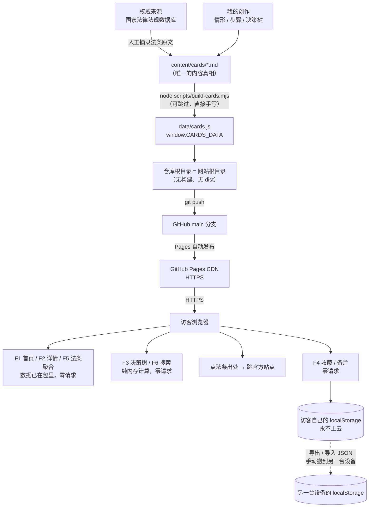

# TECH_DESIGN.md — 法律小科普轻站 V1 技术设计

> 第 1 周 · Day 5 技术设计文档 · **v3.0（决策落地版 · 纯静态路线）**
> 上游：`PRD.md`（Day 4）｜下游：目录与 UI 搭建（Day 6）、MVP 上线（Day 7）
> 上一版 v2.0（默认 CloudBase 的分阶段方案）保存在 git 提交 `da56dae` 里，可 `git show da56dae:TECH_DESIGN.md` 回看。

**本文档的写作红线**：只做设计与对比，**不创建任何文件、不写代码**。文中出现的目录与文件名是 Day 6 动手时的依据，现在磁盘上并不存在。

---

## 0. 决策摘要（先看这一节就够）

### 0.1 三个答复如何改变了结论

v2.0 曾把「CloudBase 一体化」定为默认路线，前提是三个假设。这三个假设现已全部被否定：

| # | v2.0 的疑问 | 你的答复 | 直接后果 |
|---|---|---|---|
| 1 | 有腾讯云账号吗（实名认证）| **没有** | CloudBase 的**阶段 1（静态托管）也走不了**，不是"以后再说"的问题 |
| 2 | 收藏/备注上云能否接受 | **不接受** | 后端、数据库、匿名登录**全部不需要存在**；PRD §8.3「不收集任何用户身份信息」原封不动成立 |
| 3 | 免费档「仅供开发测试」中间页能否接受 | **不接受** | 想去掉中间页要 ¥19.9/月 + ICP 备案（1–20 工作日），比没账号更远 |

> **一句话**：方案 B（CloudBase）与方案 C（Vercel + Supabase）双双出局，**方案 A（纯静态）从"备选"变成唯一可行路线，而且它是恰好与你的三个答复完全兼容的那一套**。

### 0.2 最终技术选型一页纸

| 层 | 选什么 | 一句话理由 |
|---|---|---|
| **前端** | **原生 HTML / CSS / JavaScript**，多页面 | 无框架、无构建、无 `npm run build`，排错只有浏览器一层 |
| **页面组织** | 6 个独立 HTML 页面 + 1 个 404 页 | GitHub Pages 不支持 SPA 路由回退，多页面天然规避 |
| **内容数据** | `content/cards/*.md`（人写）→ `data/cards.js`（机器读） | 保住「内容与页面分离」，且双击本地文件就能预览 |
| **用户数据** | **浏览器 localStorage，永不上云** | 你的第 2 条答复；也正是 PRD §8.3 的原始要求 |
| **后端** | **无** | 7 个功能全部前端可完成（见 §1.1） |
| **数据库** | **无** | 同上 |
| **托管** | **GitHub Pages** | 零成本、`git push` 即发布、PRD §8.4 已把 GitHub Pages 列为合格渠道 |
| **构建工具** | **无**（只有一个可选的 Node 脚本把 md 汇总成 js） | 少一层工具就少一类报错 |
| **版本管理** | Git + GitHub（仓库不变） | 托管平台和代码托管本来就无关 |

### 0.3 这一版相对 v2.0 改了什么

| 处理 | 内容 |
|---|---|
| **保留** | §1 认知打底（前端/后端/数据库谁管什么）、§2 三方案八维对比（Day 5 作业要求，**整表原样保留**）、§8 数据流思路、§9 错误处理清单、§15 验收对照 |
| **翻转** | 默认路线由「CloudBase 分两阶段」改为「纯静态一步到位」；§3 推荐结论、§4 技术栈、§5 目录结构、§7 接口清单、§11 部署全部重写 |
| **删除** | 云函数、PostgreSQL、匿名登录、SQL 建表与 RLS、`tcb` CLI、环境变量与密钥管理、阶段 2 迁移方案、资源点计费实算 |
| **降级为备用** | 那套后端设计不是"错的"，而是"用不上的"。它仍完整保留在 `da56dae` 里；如果 V2 真要跨设备同步（Day 22–28），再把它捞回来 |

---

## 1. 认知打底：本站为什么不需要后端

| 角色 | 住在哪 | 负责什么 | 打个比方 |
|------|--------|---------|---------|
| **前端** | 访客的浏览器 | 显示页面、响应点击、渲染列表、存收藏 | 餐厅的**大堂和菜单** |
| **后端** | 服务商的服务器 | 校验参数、判断权限、读写数据 | 餐厅的**后厨** |
| **数据库** | 服务器上（后端旁边）| 长期保存数据（用户、收藏、内容）| 后厨的**仓库** |

**识别口诀**：凡是「**在别人电脑上替你保管东西**」的需求，才需要后端和数据库。

- 「把准备好的内容送到用户眼前」→ 不需要（静态文件本身就是内容）
- 「用户下次换台设备还能看到自己收藏的卡片」→ 需要（**而这一条你已明确不做**）
- 「用户在这台设备上刷新页面收藏还在」→ 不需要（localStorage 足够）

### 1.1 本站 7 个功能归谁管（结论：全部归前端）

| 功能 | 归谁管 | 说明 |
|------|:---:|------|
| F1 情形清单 | 前端 | 数据打包在 `data/cards.js` 里，不发请求 |
| F2 详情页 | 前端 | 同上 |
| F3 看情况选我做 | **前端** | 决策树逻辑写死在客户端，**永远不发请求**（PRD §8.1 硬性验收）|
| F4 收藏 / 备注 | **前端 + localStorage** | 本站唯一"用户数据"，永不离开这台设备 |
| F5 法条聚合 | 前端 | 页面加载时从卡片数据现算 |
| F6 搜索 | **前端** | 在内存里做字符串匹配，**永远不发请求**（PRD §8.1 硬性验收）|
| F7 关于页 | 前端 | 静态页面 |

> **两条硬约束（来自 PRD §8.1，不能被技术方案破坏）**：
> ① F3 决策树的每次点击、F6 搜索的每次输入，**Network 面板必须看不到任何请求**；
> ② F4 收藏/备注只存本地，**不产生任何网络请求**。
> 纯静态方案是这两条约束的**最强形态**——整个站点从加载完成到关闭，请求数恒定为 0。

### 1.2 一个必须澄清的误会

「纯静态」不等于「内容写死在 HTML 里」。本站内容与页面是分开的：

- 内容住在 `data/cards.js`（一个数据文件）
- 页面只负责"把数据渲染出来"

所以将来改一张卡片，改的是数据，不是页面；将来换托管平台，传的还是同一堆文件。**"没有后端"和"结构混乱"是两件无关的事。**

---

## 2. 三套方案对比（Day 5 作业要求，整节保留）

### 2.1 方案定义

| 代号 | 方案 | 一句话 |
|---|---|---|
| **A** | **GitHub Pages 纯静态** | 前端（HTML/CSS/JS）+ 内容静态烘焙 + GitHub Pages 托管，无后端无数据库，收藏存 localStorage |
| **B** | **CloudBase 一体化**（v2.0 的默认）| React/Vite + CloudBase 云函数（Node.js）+ CloudBase PostgreSQL + CloudBase 静态网站托管 |
| **C** | **Vercel/Netlify + Supabase** | React/Vite + Vercel 边缘函数 + Supabase（PostgreSQL + Auth），海外平台 |

### 2.2 八维对比总表

| 维度 | **A 纯静态** | **B CloudBase 一体化** | **C Vercel + Supabase** |
|------|------------|---------------------|----------------------|
| **① 前端** | HTML/CSS/JS；或 React/Vite | React/Vite（官方有 React Web 应用模板）| React/Vite |
| **② 后端** | 无 | CloudBase 云函数（Node.js），HTTP 访问服务暴露 REST | Vercel Serverless / Edge Functions |
| **③ 数据库** | 无（浏览器 localStorage）| CloudBase PostgreSQL（上海地域 PG 版环境，兼容 Supabase 范式）| Supabase PostgreSQL |
| **④ 学习成本** | ⭐ 最低。只有 HTML/CSS/JS + git | ⭐⭐⭐ 最高。要同时理解：构建工具、云函数、SQL、鉴权、CDN 缓存 | ⭐⭐⭐ 高。概念与 B 类似，但文档为英文、社区答案偏英文 |
| **⑤ 线上持久化** | ❌ 无。换设备/清缓存即丢 | ✅ 有。数据在腾讯云，可演进为跨设备 | ✅ 有 |
| **⑥ 费用** | **0 元**（Pages 免费，无额度上限）| 免费档 3000 资源点/月（≈¥3）；要绑自定义域名需升 ¥19.9/月 + 备案 | 免费档较好（Supabase 500MB PG），但国内访问要另付费 |
| **⑦ 排错难度** | ⭐ 最低。一个开发者工具面板搞定 | ⭐⭐⭐ 最高。**四层**：前端构建 → 云函数日志 → SQL 报错 → CDN 缓存 | ⭐⭐ 中高。日志体验好，但网络问题难判断 |
| **⑧ 部署方案** | `git push` → 自动发布，约 1–2 分钟 | CLI（`tcb`）或控制台上传；静态托管 + 云函数要分别部署 | `git push` → 自动构建部署 |

### 2.3 逐维度展开（为什么这么打分）

**① 前端** — 三套都能用 React/Vite。差别不在前端，而在「谁来喂数据」。A 是构建时把数据打进包里，B/C 是运行时可能走接口。

**② 后端** — A 完全没有。B 用云函数，好处是云函数能直接读到调用者身份（CloudBase 身份认证的 uid 会随调用上下文传进来），不用自己实现 token 签发与校验。C 的 Serverless Function 需要自己处理 JWT 校验。

**③ 数据库** — CloudBase PG 的关键特性（2026-08-10 正式支持）：**兼容 Supabase 的范式**（PostgREST 自动 REST API + RLS 行级安全 + JWT）；支持 Database Branch（数据库秒级"分叉"，可随便改 Schema 试错）。但官方明确声明**不承诺 100% API 兼容**，迁移不是零成本。

**④ 学习成本** — 从 A 到 B，多出来的是：`npm run build` 构建流程、云函数冷启动与日志、SQL 建表与索引、身份认证、CDN 缓存导致的"改了没生效"。对零基础的人，**这张清单里每一项都会真实地卡住一次**。

**⑤ 线上持久化** — 这是 B/C 唯一真正赢过 A 的地方，但**它的实际价值比听起来小**：
- 用匿名登录时，浏览器会拿到一个匿名 uid，**uid 本身也存在浏览器里**，清缓存/换设备同样会丢
- 跨设备同步必须绑手机号或微信（属 PRD §4.1 的 V2，且**与 PRD §8.3「不收集身份信息」冲突**）
- 所以它的真实价值是"为 V2 账号体系提前把数据放在服务端"，而不是"用户换手机还能看到收藏"

**⑥ 费用** — A 是 0 元且没有额度上限。B 的资源点对本站绰绰有余（v2.0 §2.4 实算约 740 点/月，免费档 3000 点），**但真正会卡人的不是资源点，是域名**：想去掉默认域名上的「仅供开发测试」中间页，必须升级个人版（¥19.9/月）并完成 ICP 备案。

**⑦ 排错难度** — 最容易被低估的一维。A 出一个 bug，打开浏览器 F12 就能看到原因。B 出一个 bug，可能是：前端代码错 / 云函数抛异常（要去控制台看日志）/ SQL 约束冲突 / CDN 缓存了旧文件——**四种原因、四个地方**。

**⑧ 部署方案** — A 最顺（push 即发布）。B 要区分静态资源和云函数两条部署链路，且默认域名只适合开发测试。

### 2.4 每套方案的「致命短板」各一条

| 方案 | 如果只能记一条短板 | 这条短板对你成立吗 |
|---|---|---|
| **A** | **国内访问不稳定**。`*.github.io` 的域名解析在国内长期不稳定，而本站是「80% 手机端、微信扫一扫」的场景，点开白屏就前功尽弃 | **部分成立**，缓解办法见 §11.4 |
| **B** | **免费档绑不了自定义域名**，默认域名会先弹「仅供开发测试」中间页 | **成立，且你已拒绝** → 出局 |
| **C** | **面向国内用户不成立**。Vercel / Supabase 在国内需要额外网络手段，且无法完成 ICP 备案 | **成立** → 出局 |

### 2.5 裁决结果

| 方案 | 裁决 | 依据 |
|---|---|---|
| **A 纯静态** | ✅ **采纳** | 唯一一个不要求账号、不要求上云、不产生中间页、不花钱的路线；且 PRD §8.4 已把 GitHub Pages 写作合格渠道 |
| **B CloudBase** | ❌ **淘汰** | 无腾讯云账号 → 连阶段 1 都起不来；且第 3 条答复直接否决了它的默认域名体验 |
| **C Vercel + Supabase** | ❌ **淘汰** | 面向国内用户不成立，等于把 A 的问题换个形式重演 |

> **决策确认（2026-09-20）**：与 Terry 确认**采用方案 A**，这与他的三条答复保持一致。
>
> 需要留痕的是**判断过程**，不是判断结果：**方案 B 并不是"更差"，而是"前提不成立"**。它的额外能力（跨设备持久化、内容免部署更新、可演进为账号体系）是真实的，但在 **PRD §10 的 28 天时间表里没有任何一天需要用到**——Day 7 上线、Day 8–14 内容填充、Day 15 用户研究、Day 16–21 V1.1 优化全都不需要后端；Day 22–28 是 **V2 策划**，产出 `v2-plan.md`，是写文档而不是实现账号系统。
>
> 更关键的是：**A 是 B 的子集**。A 的产物（相对路径的静态文件）可以原样上传到 CloudBase 静态托管，前端代码一行不改；即使将来真要接后端，改动也只落在 `js/store.js`（见 §12.3）。**所以这次选择不构成对未来的封死，只是把成本推迟到真正需要它的那天。**
>
> 已排除的路径与代价（供将来参考，不必重新调研）：
> - **升级 1（只换国内静态托管）**：需注册腾讯云账号 + 实名认证；首次访问会看到「仅供开发测试」中间页，去掉需 ¥19.9/月 + ICP 备案。收益：国内可达性变稳。
> - **升级 2（完整方案 B）**：再加云函数 + PostgreSQL + 匿名登录；需修订 PRD §8.3「不收集任何用户身份信息」，排错从一层变四层。收益：收藏/备注跨设备。

---

## 3. 最终路线与取舍

### 3.1 结论（一句话）

> **V1 走纯静态：原生 HTML/CSS/JS 多页面 + `data/cards.js` 内容数据 + localStorage 用户数据 + GitHub Pages 托管。**
> **没有阶段 1 / 阶段 2 之分——一次做完，一次上线。** 后端、数据库、登录、云函数在本项目里**全部不存在**。

### 3.2 为什么是它（4 条理由）

1. **它与你已决定的事完全同向，不是妥协。** 不上云 = 不需要后端；不注册云账号 = 不需要付费与备案。这三件事在纯静态里同时成立，在 B 里三条全部冲突。
2. **PRD 一个字都不用改。** 尤其 §8.3 那条「不收集任何用户身份信息、收藏存于 localStorage」——v2.0 需要为它写一段修订建议，现在**原封不动就是对的**。
3. **上线最短路径。** Day 7 的截止压力下，少一层构建、少一层服务端，就是少两个可能卡住一整天的环节。「先上线，再想架构」在这里不是一个口号，是日程安排。
4. **它不锁死未来。** 纯静态的产物（一堆 HTML/CSS/JS）可以零改动搬到任何静态托管平台；数据访问层（§7）也留了替换口子。真要接后端时，改的是**一个文件**，不是整个项目。

### 3.3 取舍清单（明确放弃了什么）

| 得到了 | 放弃了 |
|--------|--------|
| 零成本、零账号、零备案 | 跨设备同步（换手机看不到收藏）——**你已明确不需要** |
| `git push` 即上线，1–2 分钟 | 服务端数据（收藏只在本地，清浏览器数据即丢）|
| 排错只有一层（浏览器 F12）| 无服务端日志可查——问题全部在前端暴露，反而更好定位 |
| 内容与页面分离 | 无 Markdown → HTML 的高保真渲染（本站正文朴素，够用）|
| 换托管平台零成本 | 国内可达性仍需观察（§11.4）|

### 3.4 明确不做（连同理由一起记下来）

- ❌ **不接后端**：没有需求驱动（你已拒绝上云），且会破坏 PRD §8.1 的零请求验收
- ❌ **不做登录注册**：PRD §4.1 已列为 V2+；且与 §8.3 合规红线冲突
- ❌ **不上 React / Vite / TypeScript / Tailwind / Redux**：没有构建需求，就不引入构建链。少一个工具 = 少一类"报错看不懂"的时刻
- ❌ **不用第三方 CDN 引入 JS 库**：本站需要的功能原生 JS 全都能做；引外部依赖会给"零请求"验收带来噪音
- ❌ **不做付费、广告、统计脚本**：PRD §8.3 明确「不收取任何费用」；埋点脚本会引入第三方请求

---

## 4. 技术栈清单

| 层 | 选择 | 形态 | 为什么不选替代品 |
|---|---|---|---|
| 页面 | **原生 HTML5** | 6 个页面 + 1 个 404 页，多页面（MPA）| 不上 SPA：GitHub Pages 无服务端回退规则，多页面天然规避刷新 404 |
| 样式 | **原生 CSS + CSS 变量** | 单个 `global.css` + `tokens.css` | 不上 Tailwind：零基础时"类名地狱"比写 CSS 更难查 |
| 交互 | **原生 JavaScript（ES Module）** | `js/*.js`，浏览器原生 `import` | 不上 React：站点只有"渲染列表 + 切状态"，不需要组件框架 |
| 路由 | **多页面 + URL 查询参数** | `article.html?slug=qiye-cuidui` | 不用 hash 路由：多页面分享链接更干净，也不依赖 JS 才能打开页面 |
| 内容数据 | **`content/cards/*.md` → `data/cards.js`** | 一个可选的 Node 汇总脚本 | 保住了「内容/页面分离」这个最重要的结构性决定 |
| 用户数据 | **localStorage** | 3 个 key（§6.5）| 不用 IndexedDB：量小（几十条），且 IndexedDB 的异步 API 会平白增加复杂度 |
| 数据访问层 | **`js/store.js` 唯一入口** | 页面永远不直接碰 localStorage | 这是 v2.0 留下来的最值钱的一个设计，见 §7 |
| 托管 | **GitHub Pages** | main 分支根目录直发 | 不用 Netlify/Vercel：国内可达性同级或更差，还要另注册账号 |
| 构建 | **无**（脚本可选）| 仓库根目录 = 网站根目录 | 没有 `dist/`、没有打包、没有 `npm run build` |
| 版本管理 | **Git + GitHub** | 仓库 `Terry-RQJ/week01-vibe-coding` | 部署换平台 ≠ 代码托管换平台 |

---

## 5. 项目结构（Day 6 按这个建，本文档不创建文件）

```
Vibe Coding/                          ← 项目根 = 网站根（GitHub Pages 直接发布这里）
├── index.html                        # P1 首页：情形清单 + 搜索（F1 / F6）
├── article.html                      # P2 详情页：?slug=xxx（F2 / F3 / F4）
├── laws.html                         # P3 法条聚合（F5）
├── bookmarks.html                    # P4 我的收藏（F4）
├── about.html                        # P5 关于 + 免责声明（F7）
├── 404.html                          # V3 兜底（GitHub Pages 会自动使用它）
├── .nojekyll                         # ★ 空文件，必须有（原因见 §11.3）
├── .gitignore                        # 已有，无需大改
├── .env                              # 已有的本地占位（继续被忽略，本站其实用不到）
│
├── css/
│   ├── tokens.css                    # 颜色 / 字号 / 间距变量（对齐 PRD §5.2）
│   └── global.css                    # 全局样式 + 响应式断点（375 / 768 / 1024）
│
├── js/
│   ├── store.js                      # ★★ 唯一数据访问层（页面只调它，见 §7）
│   ├── storage.js                    # localStorage 安全包装（探测/降级/容量）
│   ├── ui.js                         # 渲染工具：卡片列表、空态、错误提示条
│   ├── search.js                     # F6 搜索（纯内存匹配）
│   ├── decisionTree.js               # F3 决策树（纯前端状态机）
│   ├── errors.js                     # 错误 → 用户可读中文文案
│   └── pages/
│       ├── home.js                   # index.html 的入口脚本
│       ├── article.js                # article.html 的入口脚本
│       ├── laws.js                   # laws.html 的入口脚本
│       ├── bookmarks.js              # bookmarks.html 的入口脚本
│       └── about.js                  # about.html 的入口脚本（通常很薄）
│
├── data/
│   └── cards.js                      # ★ 构建产物：window.CARDS_DATA = {...}（见下方说明）
│
├── content/
│   └── cards/                        # 内容源：每张卡一个 .md（唯一的内容真相）
│       ├── qiye-cuidui.md
│       ├── tuizu-yajin.md
│       └── ...（V1 共 ≥ 12 张，覆盖 6 大类）
│
├── scripts/
│   └── build-cards.mjs               # content/*.md → data/cards.js（零第三方依赖）
│
├── assets/
│   └── icons/                        # 少量 svg 图标（收藏心形、搜索等）
│
└── （已有文档，保留在根目录，见下方说明）
    AGENTS.md / research.md / PRD.md / TECH_DESIGN.md
```

**四点说明（都是容易踩的地方）**：

1. **`data/cards.js` 必须提交进仓库**。这与"构建产物不进仓库"的常规做法相反，原因是 **GitHub Pages 是「从分支直接发布」**，仓库里没有的文件用户就下载不到。所以本站**没有 `dist/` 概念**，仓库根目录就是网站根目录。
   - 内容文件用 `.js` 而不是 `.json`，是为了让 `window.CARDS_DATA` 直接可用：**双击本地 HTML 就能预览**，不必起服务器（`.json` 走 `fetch` 在 `file://` 下会被 CORS 拦）。
2. **`data/cards.js` 的生成有降级路径**。如果 Day 6 那个汇总脚本出问题，**直接手写 `data/cards.js` 也能上线**（12 张卡的量级完全扛得住）。脚本是省事用的，不是拦路用的。
3. **`.gitignore` 基本不用改**。原有的 `.env` / `*.key` / `node_modules/` 规则继续有效；可补一行 `.DS_Store` 和 `Thumbs.db`（Windows 缩略图缓存）。注意**不要**把 `data/` 忽略掉。
4. **四份设计文档会随站点公开**（它们在仓库根目录，Pages 会把整个根目录发布出去）。这其实是好事——老师打开站点就能看到你的研究、PRD 和技术设计。PRD §8.5 也要求它们在仓库里可访问。**已知情况，不做处理。**

### 5.1 Day 6 建议的搭建顺序

一次引入太多新东西是初学者最常见的翻车方式。按下表顺序做，每步都能看到结果再走下一步：

| 步 | 做什么 | 做完能验证什么 |
|---|---|---|
| 1 | 建目录骨架 + `.nojekyll` + 空的 `css/js/data` 文件（先留空）| 仓库结构对了 |
| 2 | 写 `index.html` 的静态骨架（页头 + 搜索框 + 分类区 + 空列表容器）| 浏览器能打开，样式可调 |
| 3 | 手写 1 张卡片到 `data/cards.js` | 数据结构跑通 |
| 4 | 用 `js/store.js` + `js/ui.js` 把这张卡渲染到首页 | **F1 最小闭环完成** |
| 5 | 补齐 12 张卡的内容（工作量大，可与 4 并行）| 内容验收 |
| 6 | 加 `article.html` 详情页（5 个模块骨架）| F2 |
| 7 | 加搜索（`search.js`）→ 加决策树（`decisionTree.js`）| F6 / F3 |
| 8 | 加收藏与备注（`store.js` 的本地部分）→ 加 `bookmarks.html` | F4 |
| 9 | 加 `laws.html` 聚合 → `about.html` 免责声明 → `404.html` | F5 / F7 |
| 10 | 推送 + 开 Pages + 逐条跑 §15 验收清单 | Day 7 上线 |

> **第 4 步是整条链路的"最小可运行版本"**。先让它跑通，再往上堆，比一次性写完 6 个页面再调试稳得多。

---

## 6. 数据对象及字段（对齐 PRD §6）

### 6.1 关系图

```
card（卡片）1 ──── N law（法条引用）        ← 内嵌在卡片对象里，不是独立表
   │
   ├── N related_slugs（相关拓展）           ← 卡片 slug 列表，不是 ID
   └── 1 decision_tree（决策树根节点）        ← 内嵌
                    │
                    └── N bookmark（收藏，存在浏览器）   ← 只存 slug，与卡片解耦
                    └── N note（备注，存在浏览器）       ← key 是 notes:<slug>
```

### 6.2 卡片对象（对齐 PRD §6.1）

| 字段 | 类型 | 必填 | 约束 | 说明 |
|------|------|:---:|------|------|
| `id` | string | ✅ | 唯一 | V1 直接用 `slug` 的副本即可，保留字段是为了将来能换 |
| `slug` | string | ✅ | kebab-case，**全站唯一** | URL 用，如 `qiye-cuidui` |
| `title` | string | ✅ | ≤ 30 字 | 卡片标题 |
| `summary` | string | ✅ | ≤ 60 字 | 首页一句话摘要 |
| `category` | string | ✅ | 限 6 类之一 | 劳动 / 消费 / 借贷 / 婚姻家庭 / 交通 / 邻里 |
| `tags` | string[] | ✅ | — | 如 `["公司劝退","赔偿","录音"]` |
| `scenario` | string | ✅ | ≤ 150 字 | 「情形」模块 |
| `laws` | object[] | ✅ | ≥ 1 条 | 「法律条文」模块，结构见 §6.3 |
| `solution_steps` | string[] | ✅ | ≤ 3 步 | 「怎么解决」模块 |
| `decision_tree` | object | ✅ | 深度 ≤ 3 层 | 「看情况选我做」，结构见 §6.4 |
| `related_slugs` | string[] | ✅ | 3–5 个 | 「相关拓展」 |
| `author_type` | string | ✅ | 枚举 | 「AI 起草 + 律师复核」/「全部律师手写」|
| `reviewed_by` | string | ✅ | — | 复核人（V1 占位但必须有此字段）|
| `status` | string | ✅ | 枚举 | `draft` / `published` / `archived` |
| `published_at` | string | ✅ | ISO date | 发布日期 |
| `updated_at` | string | ✅ | ISO date | 最后更新 |

> **注意一个与 v2.0 的差别**：PRD §6.1 写的是 `related_articles`（ID 列表），这里定为 `related_slugs`（slug 列表）。理由是纯静态站点没有数据库，URL 里出现的就是 slug，用 slug 关联可以少一次换算。**这是本文档对 PRD 的唯一一处字段名变更，Day 6 落地时以本文档为准**；若坚持与 PRD 完全一致，把该字段名改回 `related_articles` 即可，不影响其他设计。

### 6.3 法条引用对象（对齐 PRD §6.2）

| 字段 | 类型 | 必填 | 约束 | 说明 |
|------|------|:---:|------|------|
| `law_name` | string | ✅ | — | 如「中华人民共和国民法典」|
| `article_no` | string | ✅ | — | 如「第 1062 条」|
| `content` | string | ✅ | ≤ 200 字 | **逐字引用，不改编**（改编算侵权，PRD §8.2）|
| `source_url` | string | ✅ | **必须官方源** | 国家法律法规数据库 / 全国人大 / 政府部门官网 |
| `effective_date` | string | 否 | ISO date | 生效日期，便于以后版本切换 |

> **`content` 与 `source_url` 是内容验收的高危项**：法条原文必须逐字，链接必须能打开到正确页面（404 / 302 到无关页 = 不合格，PRD §8.2）。

### 6.4 决策树节点（对齐 PRD §6.3）

结构沿用 PRD 的定义，字段如下（不写代码，只描述形状）：

| 字段 | 类型 | 何时有 | 说明 |
|------|------|--------|------|
| `id` | string | 始终 | 节点 ID |
| `type` | string | 始终 | `question`（选择题）/ `result`（终点）|
| `text` | string | 始终 | 题目文案或结论文案 |
| `options` | object[] | `type = question` | 每项含 `label`（选项文案）+ `next`（下一个节点）|
| `law_refs` | object[] | `type = result` | 本结论对应的法条，结构同 §6.3 |
| `action` | string | `type = result` | 「建议你这样做」|

**两条设计约束**（来自 PRD §8.1 / §8.3）：
- 深度 ≤ 3 层，每张卡至少 3 个分支终点
- 终点**不输出**「你应该去告 / 不告」这类结论，只输出「建议这样做 + 法条依据」

### 6.5 用户数据：localStorage（对齐 PRD §6.4）

| Key | 类型 | 说明 | 上限 |
|-----|------|------|------|
| `bookmarks` | `string[]`（slug 列表）| 已收藏卡片 slug | 无硬上限（实际 ≤ 卡片总数）|
| `notes:<slug>` | `string` | 每张卡片一条备注 | **500 字**（PRD §3.4，写入前截断并提示）|
| `bookmarks_updated_at` | ISO 字符串 | 最后修改时间，用于"导出收藏"与迁移判断 | — |
| `schema_version` | `string` | 固定 `"1"`，为将来数据结构变更留的退路 | — |

> **与 v2.0 的一个关键差别**：v2.0 这里存的是"卡片 UUID"，现在改为**存 slug**。理由：纯静态站点里 slug 才是唯一标识（URL、文件名、卡片对象三处一致），多保留一层 UUID 只会增加对不上的风险。

### 6.6 法条聚合索引（F5，页面打开时现算）

| 字段 | 来源 |
|------|------|
| `law_name` | 遍历所有卡片的 `laws[].law_name` |
| `article_no` | 同上 |
| `content` | 同上 |
| `source_url` | 同上 |
| `referenced_by` | 反向索引：所有引用了该法条的卡片 slug 列表 |

**实现要点**：聚合在**页面打开时算一次**，把结果缓存在内存变量里即可（`laws.html` 不涉及高频刷新）。12 张卡片的量级下，这个计算耗时在 1 毫秒以内。

### 6.7 一个刻意的"不做"

**不建"数据校验脚本"**。V1 的字段完整性靠**内容评审**（`AGENTS.md` 里的自检清单）来保证，而不是靠代码。
理由：写一个校验器的成本比人工检查 12 张卡还高，而且校验器本身也会出错、也要维护。等卡片超过 50 张再考虑。

---

## 7. 数据访问层契约（`js/store.js`）

### 7.1 为什么要单独一层

**页面代码永远不直接读写 `localStorage`，也不直接遍历 `window.CARDS_DATA`**，一律通过 `js/store.js` 暴露的函数。

好处有三条：
1. **收藏逻辑只写一遍**。收藏按钮在详情页、收藏列表在 P4、计数在页头——三处都需要读写同一份数据，集中在一层才不会出现"三处逻辑不一致"。
2. **将来要换实现时只改这一个文件**。若 V2 真接了后端，把 `store.js` 内部从 localStorage 改成调用接口即可，**页面一行不动**。
3. **localStorage 的坑只在一个地方处理**（禁用、隐私模式、容量超限、JSON 解析失败）。散落在各处必然是灾难。

### 7.2 内容接口（只读）

| 函数 | 入参 | 返回 | 说明 |
|------|------|------|------|
| `listCards(options)` | `{ keyword?, category? }` | 卡片摘要数组 | 首页 F1；返回项只含 `slug/title/summary/category/tags/published_at`（列表不需要正文）|
| `getCard(slug)` | slug | 完整卡片对象 或 `null` | 详情页 F2；`null` 表示卡片不存在或未发布 |
| `listCategories()` | — | 分类数组（含每类卡片数）| 首页分类区；固定 6 类，空类也要显示 |
| `getLaws()` | — | 聚合后的法条数组（见 §6.6）| 法条页 F5 |
| `search(keyword)` | 字符串 | 卡片摘要数组 + 命中数 | F6；**纯内存匹配，不发请求** |

**规则**：`status !== "published"` 的卡片，`listCards` / `search` / `getCard` 全部**不返回**（草稿不下发给访客）。这是"下架卡片"的唯一实现方式（因为没有后端可拦）。

### 7.3 用户数据接口（本地）

| 函数 | 入参 | 返回 | 说明 |
|------|------|------|------|
| `isBookmarked(slug)` | slug | 布尔 | 详情页收藏按钮的初始状态 |
| `toggleBookmark(slug)` | slug | `{ bookmarked, total }` | 一次调用完成"收藏/取消"并回传最新计数 |
| `listBookmarks()` | — | 已收藏的卡片摘要数组 | P4 我的收藏；**按收藏时间倒序**；卡片被下架时自动跳过 |
| `countBookmarks()` | — | 数字 | 页头「当前共收藏 X 张」|
| `getNote(slug)` | slug | 字符串（无则空串）| 详情页备注框初始值 |
| `saveNote(slug, text)` | slug + 文本 | `{ ok, truncated }` | 超 500 字时**截断并回传 `truncated: true`**，由 UI 提示 |
| `deleteNote(slug)` | slug | 布尔 | 删备注 |
| `exportData()` | — | 一个 JSON 字符串 | PRD §3.4 的「导出收藏」，结构见 §12.1 |
| `importData(json)` | JSON 字符串 | `{ imported, skipped }` | 见 §12.1，**导入前必须先校验格式**，坏数据宁可拒绝 |
| `clearUserData()` | — | 布尔 | 清空收藏与备注（需 UI 二次确认）|

### 7.4 返回值与错误约定

| 项 | 约定 |
|---|---|
| **失败形式** | 不抛异常给页面层，统一返回 `null` / `false` / `{ ok: false, reason }`，由 `js/errors.js` 翻译成中文文案 |
| **原因码** | `STORAGE_UNAVAILABLE`（浏览器禁用）/ `STORAGE_FULL`（容量超限）/ `CARD_NOT_FOUND`（slug 不存在）/ `INVALID_DATA`（导入格式错）|
| **文案来源** | 全部集中在 `js/errors.js`，**页面里不写死任何错误句子**，避免同一个错误在不同页面出现三种说法 |
| **纯内存操作** | `listCards` / `search` / `getLaws` / `getCard` 都是同步函数，无 Promise、无 loading 状态——这是纯静态方案的一个实际红利 |
| **写操作** | `toggleBookmark` / `saveNote` 也是同步的（localStorage 是同步 API），因此 v2.0 那套"乐观更新 + 失败回滚"的复杂逻辑**整节可以删掉** |

> **这条差异值得单独强调**：v2.0 §8.3 花了半页写"先改界面再发请求、失败要回滚"。纯静态下**没有请求**，这个复杂度自然消失——用户点收藏，界面和存储在同一帧里完成，不可能出现"界面说收藏了但实际没存"。**少一个请求，就少一整类一致性问题。**

---

## 8. 数据流

### 8.1 两条线（v2.0 有三条，现在只剩两条）

```
═══════════ 线 1：内容从哪来（在我的电脑上，用户看不到）═══════════

  【权威来源】                         【我的创作】
  国家法律法规数据库                    每张卡片一个 .md
  flk.npc.gov.cn                      content/cards/*.md
        │                                    │
        │ 人工摘录法条原文                      │ 写：情形 / 步骤 / 决策树
        ▼                                    ▼
   ┌──────────────────────────────────────────────────┐
   │  cards/*.md（头部字段 + 正文 + 法条 + 决策树）       │
   └──────────────────────────────────────────────────┘
                          │
                          │ node scripts/build-cards.mjs
                          │ ★ 出问题可跳过：直接手写 data/cards.js
                          ▼
               ┌──────────────────────────┐
               │  data/cards.js            │  ← 前端唯一内容数据源
               │  window.CARDS_DATA = {...} │
               └──────────────────────────┘

═══════════ 线 2：内容怎么送到用户眼前 + 用户数据去哪 ═══════════

  我的电脑          Git 仓库（GitHub）      GitHub Pages       访客浏览器
  ┌────────┐ git push ┌────────────┐  自动发布 ┌──────────┐  HTTPS  ┌────────────┐
  │ 仓库根  │ ───────► │ main 分支   │ ───────► │ 全球 CDN  │ ──────► │ 打开页面    │
  │ 全部文件│          │ + .nojekyll│          │ 节点      │        └─────┬──────┘
  └────────┘          └────────────┘          └──────────┘              │
                                                                        │
    ┌───────────────────────────────────────────────────────────────────┤
    ▼                    ▼                    ▼                ▼        ▼
 F1 首页渲染        F6 搜索             F3 决策树        F5 法条聚合   点法条
 （数据已在         （内存匹配）        （本地算）        （内存现算）  → 跳官方源
   包里）          【零请求】          【零请求】        【零请求】   （离开本站）
    【零请求】

    ▼
 F4 收藏 / 备注 ──► 他自己的 localStorage
    【零请求 · 永不上云 · 清浏览器数据即丢】

  ※ 全网请求数：页面加载完成后恒为 0。没有"线 3"。
```

### 8.2 Mermaid 版（GitHub 网页会渲染成图）



### 8.3 关键时序：收藏一次点下去，发生了什么

```
用户            页面 js                      localStorage
 │               │                              │
 │ 点击「收藏」    │                              │
 ├──────────────►│                              │
 │               │ ① toggleBookmark(slug)        │
 │               ├─────────────────────────────►│
 │               │    读 bookmarks → 增删该 slug  │
 │               │◄─────────────────────────────┤
 │               │ ② 同一帧内更新按钮状态为「已收藏✓」│
 │  ← 立刻看到「已收藏 ✓」+ 页头计数 +1             │
 │               │                              │
 │ 刷新页面        │                              │
 ├──────────────►│ ③ isBookmarked(slug)          │
 │               ├─────────────────────────────►│
 │  ← 状态仍是「已收藏 ✓」（这是 F4 的验收点）      │
 │               │                              │
 │ 【若浏览器禁用了 localStorage】                 │
 │  ← 按钮 hover 提示「需允许浏览器存储才能使用收藏」  │
 │    内容仍可正常阅读，不白屏                      │
```

**与 v2.0 的差别**：没有网络请求，因此没有"失败回滚"这一整套逻辑。唯一的失败模式是**浏览器存储不可用**，处理方式是"降级提示"而不是"回滚状态"。

---

## 9. 错误处理

### 9.1 全局

| 场景 | 处理 |
|---|---|
| 页面 JS 报错 | `window.onerror` + `unhandledrejection` 兜底，在页面顶部插入一条可关闭的错误提示条（不白屏）|
| 内容数据没加载出来 | 页面入口先检查 `window.CARDS_DATA` 是否存在；不存在则显示「内容加载失败，请刷新页面」+ 刷新按钮 |
| 直接访问 `article.html?slug=不存在` | 显示「这篇卡片暂时无法显示」+「返回首页」按钮（PRD §7 的 404 行）|
| 直接访问不存在的路径 | GitHub Pages 自动使用 `404.html`，其中放「页面不存在 + 回首页」|
| 图片 / 图标加载失败 | `onerror` 兜底：隐藏图片或换成占位符，不留破图 |
| 网络不可用 | `navigator.onLine` 监听，顶部提示「当前网络不可用」；**已加载的页面内容仍可正常阅读**（静态资源已缓存）|
| JS 被禁用 | `<noscript>` 提示「本站需要开启 JavaScript 才能正常显示内容」（PRD §7 承认的已知代价）|

### 9.2 localStorage 专项（本站唯一的"存储层"）

| 场景 | 处理 |
|---|---|
| 浏览器禁用存储 / 隐私模式 | `js/storage.js` 启动时做一次写入探测；不可用时收藏/备注按钮**禁用 + hover 提示**，其余功能不受影响 |
| 容量超限（`QuotaExceededError`）| 备注有 500 字上限，实际很难触发；一旦触发，提示「本地存储空间不足，请清理浏览器数据后重试」，并**保留用户已输入的文本**（不清空输入框）|
| 存的 JSON 被手动改坏 | 读取时 `try/catch` + 类型校验；坏数据视为空值，并在控制台打印一条警告（**不让整页崩掉**）|
| 用户清除了浏览器数据 | 属预期行为，按 PRD §8.3 在关于页与收藏页明确告知「清除浏览器数据 = 收藏丢失」|
| 跨设备 | 不自动同步（无服务器）；提供 §12.1 的导出/导入 JSON 作为手动方案 |

### 9.3 与 PRD §7 九种异常状态的对照

| PRD §7 异常 | 本方案的落地位置 |
|---|---|
| 404 URL 不存在 | `404.html` + `article.html` 的 slug 校验 |
| 500 资源加载失败 | 全局 `window.onerror` 提示条 + 静态资源 `onerror` 兜底 |
| 空数据 1（无收藏）| `bookmarks.html` 空态：「还没有收藏，去首页看看吧」+ 跳首页按钮 |
| 空数据 2（搜索无命中）| 搜索结果区空态：「没找到，试试搜『借条』或『合同』」|
| 空数据 3（无相关拓展）| `related_slugs` 为空时显示「更多内容正在准备中」|
| 断网 | `navigator.onLine` 提示；内容仍可读 |
| localStorage 不可用 | `js/storage.js` 探测 + 按钮禁用提示 |
| 法条链接失效 | 外链 `target="_blank"` + 跳转前提示「此链接可能已失效，请以法律原文为准」|
| JS 禁用 | `<noscript>` 提示（已知代价）|

### 9.4 内容层面的"错误"（纯静态特有）

没有后端校验，内容错误会直接上线。因此把校验前移到**提交前**：

- 法条原文、`source_url` 的有效性 → 人工抽查（PRD §8.2 要求）
- 卡片必填字段缺失 → `content/` 里的写作模板固定字段顺序，肉眼可查
- **不做**自动校验脚本（理由见 §6.7）

---

## 10. 配置与密钥

### 10.1 本站根本没有密钥

**这是纯静态方案最大的一个安全红利**：前端代码是公开的，但本站**没有任何东西需要保密**——没有连接串、没有 API Key、没有 Token、没有服务端环境变量。

| 需要"配置"的东西 | 放在哪 | 敏感吗 |
|---|---|---|
| 站点标题、免责声明文案、紧急电话（12348 / 110）| 写在 `about.html` 与页脚模板里 | 否 |
| 卡片内容数据 | `data/cards.js` | 否（本来就是要公开的）|
| 分类列表、每页显示条数等前端常量 | `js/config.js`（可选，一个普通 js 文件）| 否 |
| GitHub Pages 的开启配置 | 在 GitHub 仓库的 Settings 里点几下 | 否 |

### 10.2 铁律（为将来留的）

> ⚠️ **一旦将来真的要接入任何第三方服务，密钥绝不能写进前端代码。**
> 前端的一切（HTML / CSS / JS / JSON）都是**任何人按 F12 就能看到**的。哪怕写在 `.env` 里，纯静态站点也没有"构建时注入"这一步来保护它。
> **纯静态站点的正确做法是：不接入任何需要密钥的服务。** 如果非接不可，那说明本项目已经需要后端了，应回到 `da56dae` 的 v2.0 设计。

### 10.3 `.gitignore` 现状

当前 `.gitignore` 已覆盖 `.env` / `.env.local` / `.env.*.local` / `*.key` / `*.pem` / `node_modules/` / `dist/` / `build/`。本站实际只需要其中一部分，但**留着无害**（PRD §8.5 的 `.env` 404 验收继续成立）。

建议补充（非必须）：`.DS_Store`、`Thumbs.db`、`.vscode/`、`.tmp-*`。
**注意：不要忽略 `data/`**（它是要发布的产物）。

---

## 11. 部署：GitHub Pages

### 11.1 首次部署 6 步

| 步 | 做什么 | 成功现象 |
|---|---|---|
| 1 | 确认仓库根目录有 `index.html` 和 `.nojekyll`（空文件即可）| 本地 `ls` 能看到 |
| 2 | `git push` 到 `main` 分支 | 远端仓库文件齐全 |
| 3 | 浏览器打开仓库 → **Settings → Pages** | 看到 Pages 配置页 |
| 4 | **Source** 选 `Deploy from a branch`；**Branch** 选 `main` + 目录 `/ (root)`；保存 | 页面顶部出现站点地址 |
| 5 | 等 1–2 分钟，访问 `https://terry-rqj.github.io/week01-vibe-coding/` | **首页能打开，样式正常** |
| 6 | 逐个点开 5 个页面 + 直接访问一个不存在的路径测 404 | 页面 200；未知路径显示你的 404 页 |

> **第 5 步的"样式正常"要重点确认。** 如果页面能开但一片空白或没有样式，**99% 是路径问题**——见 §11.3 第 1 条。

### 11.2 日常发布

| 发布内容 | 命令 | 生效时间 |
|---|---|---|
| 改页面 / 样式 / 内容（绝大多数情况）| `git add . && git commit -m "Day N｜..." && git push` | 1–2 分钟 |
| 卡片内容改了 | 同上（若用脚本，先跑 `node scripts/build-cards.mjs`）| 同上 |

**没有第二步了。** 这是纯静态方案最舒服的地方：**`git push` 就是发布**，没有 CLI、没有控制台、没有云函数部署、没有缓存要清。

### 11.3 三个必踩的坑

**坑 1：绝对路径（最容易翻车、后果最严重）**

GitHub Pages 的项目站点是**子路径**：`https://terry-rqj.github.io/**week01-vibe-coding**/`。所以：

| 写法 | 结果 |
|---|---|
| `<link href="/css/global.css">` | ❌ **404**。浏览器会去找 `https://terry-rqj.github.io/css/global.css`（少了仓库名）|
| `<link href="./css/global.css">` | ✅ 正确 |
| `<script src="js/store.js">` | ✅ 正确（相对路径）|
| `<a href="article.html?slug=x">` | ✅ 正确 |
| `<a href="/article.html?slug=x">` | ❌ 404 |

**规则：全站所有内部链接与资源引用一律用相对路径，不出现以 `/` 开头的路径。**
（这也是本站不用 Vite/React 的一个额外好处：v2.0 §12.2 里那个"vite base 配错就白屏"的坑，在这里根本不存在。）

**坑 2：`.nojekyll`**

GitHub Pages 默认用 Jekyll 处理你的文件，它会**忽略所有以 `_` 开头的文件和目录**。本站当前没有这类路径，但加一个**空文件 `.nojekyll`** 是零成本保险，同时能跳过 Jekyll 构建、加快发布。

**坑 3：缓存**

GitHub Pages 的 CDN 缓存**约 10 分钟**，且免费版**无法自定义缓存策略**。表现为："我明明改了，刷新还是旧的。"
应对：
- 强刷（`Ctrl + F5`）或开无痕窗口验证，别急着怀疑代码
- 页面改动最好一次性验证完，不要频繁微调后立刻刷新
- 发布后等 1–2 分钟再打开，是正常节奏

### 11.4 国内可达性：现实与缓解

这是方案 A 唯一真实的短板，必须写清楚，不能装作不存在。

**现实**：`*.github.io` 在国内的 DNS 解析与访问**长期不稳定**，不同运营商、不同时间表现不同，可能时好时坏。

**缓解手段（按可行性排序）**：

| 手段 | 成本 | 说明 |
|---|---|---|
| **接受现状**，面向能访问 GitHub 的受众 | 0 | 你的用户大概率是同学和老师（校园网络环境），这条短板很可能**根本不成立** |
| **保留一份可搬走的产物**，随时换托管 | 0 | 纯静态的最大优势：同一堆文件**零改动**就能部署到任何静态托管平台。真要换，是"上传文件"，不是"改项目" |
| 换国内静态托管 | 需账号 + 可能需备案 | 已被你的答复排除（无账号 / 不接受中间页）|

**共同结论**：不为此改变架构。**先上线，把可达性作为一个需要观察的事实记下来**，而不是一个需要现在就解决的问题。

### 11.5 回滚

| 要回滚什么 | 怎么做 |
|---|---|
| 页面 / 内容 | `git revert <提交>` 或 `git checkout <旧提交> -- <文件>` 后重新 push |
| 整个站点 | 在仓库 Settings → Pages 里改分支，或直接把 main 分支回退到旧提交 |
| 用户数据 | **没有回滚**——收藏与备注在用户自己的浏览器里，站点回滚不会影响它们，**但站点也永远无法恢复用户的本地数据**。这是"不收集数据"的另一面 |

---

## 12. 迁移与演进

### 12.1 跨设备搬收藏（不需要服务器）

你拒绝了上云，但"换台设备还能看到收藏"这个需求本身是合理的。**用文件搬运解决**：

| 步 | 做什么 |
|---|---|
| 1 | P4 收藏页提供「导出我的收藏」按钮 → 下载一个 JSON 文件 |
| 2 | 导出内容包含：`schema_version`、`exported_at`、`bookmarks`（slug 列表）、`notes`（slug → 文本）、以及每张卡片的标题（**只给自己看，方便辨认**）|
| 3 | 在另一台设备打开同一站点 → 「导入收藏」→ 选文件 |
| 4 | 导入时**先校验 `schema_version` 与数据结构**，格式不对就整体拒绝（宁可不让导入，也不让半份坏数据污染本地）|
| 5 | 导入策略：**合并**（同一个 slug 取更新时间较晚的一条），不直接覆盖 |

**安全提示（必须写进 About 页）**：导出文件里含备注正文，可能涉及个人纠纷信息，**不要随手发到群里或云盘公开链接**。

> **这个设计恰好回应了你的第 2 条答复**：想要跨设备，用文件，不用服务器。既没有上云，也没有丢功能。

### 12.2 换托管平台的成本

| 从 → 到 | 要改什么 | 不用改什么 |
|---|---|---|
| GitHub Pages → 任何静态托管 | **几乎什么都不用改**（前提：§11.3 坑 1 已遵守，全站相对路径）| 全部页面、样式、脚本、内容数据 |
| 单页面 → 多页面（或反之）| 页面组织方式 | `js/store.js` 契约、`data/cards.js`、内容 md |

> 只要守住两件事——**内容与页面分离**、**`store.js` 唯一数据访问层**——换平台永远是"搬文件"，不是"重写项目"。

### 12.3 将来真要接后端（V2，Day 22–28 再判断）

如果那时你改变主意（比如想要跨设备自动同步、想要评论、想要统计），**不需要重写项目**：

| 要做的事 | 范围 |
|---|---|
| 起后端与数据库 | 采用 `da56dae`（v2.0）里已经设计好的那套（云函数 + PG + 匿名登录）|
| 前端改造 | **只改 `js/store.js` 内部的用户数据部分**（`isBookmarked` / `toggleBookmark` / `listBookmarks` / `getNote` / `saveNote` 五个函数）|
| 页面改造 | **0 行**——页面只调 `store.js`，不知道数据存在哪 |
| PRD 改造 | 必须修订 §8.3（"不收集任何用户身份信息"），并把隐私说明写清楚 |

**但请记住**：届时你需要账号、需要处理备案、需要重新面对中间页问题。**现在不做，是因为它此刻是纯粹的成本，而不是收益。**

### 12.4 红线

- 🔴 **任何情况下不把用户备注正文发到任何外部服务**（没有这个通道，也就没有泄露风险）
- 🔴 **不在 `data/cards.js` 或任何前端文件里写密钥**（将来若有人让你在页面里填 API Key，那是错的）
- ⚠️ **法条原文必须逐字引用**（改编算侵权，PRD §8.2）
- ⚠️ **法条 `source_url` 必须指向官方源**（国家法律法规数据库 / 全国人大 / 政府部门官网），不引私人博客
- ⚠️ **`.env` 继续保持在 `.gitignore` 里**（PRD §8.5 验收：`/contents/.env` 返回 404）
- ⚠️ **四份设计文档会随站点公开**（已知情况，不做处理，见 §5 说明 4）

---

## 13. 仍需你确认的问题

v2.0 的 8 个问题里，**5 个已由你的答复解决或被作废**：

| 原问题 | 状态 |
|---|---|
| 1 有腾讯云账号吗 | ✅ 已答（没有）→ 方案 B 出局 |
| 2 收藏备注上云 | ✅ 已答（不接受）→ 后端与数据库整体取消 |
| 3 默认域名中间页 | ✅ 已答（不接受）→ CloudBase 体验不可用 |
| 4 免费档能否选 PG | ⚪ **作废**（不再用 CloudBase）|
| 5 超出资源点的后果 | ⚪ **作废**（不再有资源点）|
| 8 React 基础如何 | ✅ **已被本文档的决定吸收**：V1 用原生 HTML/CSS/JS，**连 React 都不引入**，所以基础如何都不影响 Day 6–7 |

**只剩 2 个真正需要你回答的问题**（都只影响内容与节奏，不影响架构）：

| # | 问题 | 为什么还问 | 我的默认假设（你不答我就按这个做）|
|---|---|---|---|
| **A** | **这个站你打算给谁看？**（只有同学老师 / 还是真给陌生人用）| 决定 §11.4「国内可达性」这条短板是否成立，以及内容语气要多正式 | 按「**同学、老师、小范围分享**」处理：内容可以更口语，可达性风险记为已知项，不做额外动作 |
| **B** | **从今天到 Day 7 上线，你每天大概能投入几小时？** | 决定 §5.1 那 10 个步骤是否需要再压缩（尤其第 5 步"补齐 12 张卡内容"是最耗时的）| 按「**每天 2–3 小时**」处理：Day 6 做步骤 1–6（骨架 + 1 张卡跑通 + 详情页），Day 7 做步骤 7–10（搜索/决策树/收藏/法条页 + 上线），内容分批补 |

> **和 v2.0 不同的是**：这两个问题的答案**不会改变技术方案**，只影响内容语气与进度安排。**§5 的目录结构现在就可以动手搭，不必等这两个答案。**

---

## 14. 风险与不做清单

### 14.1 不做

- ❌ **本文档不写代码、不创建文件**
- ❌ **不接后端、不做登录、不上数据库**（§1.1、§3.4）
- ❌ **不引入 React / Vite / TypeScript / Tailwind / Redux / 任何第三方 JS 库**
- ❌ **不在 V1 做跨设备自动同步**（提供 §12.1 的导出/导入替代）
- ❌ **不做自动数据校验脚本**（§6.7）
- ❌ **不回复"回头大改 PRD"**——V3.0 已经做到**不需要改 PRD 任何一条验收标准**

### 14.2 风险

| 风险 | 影响 | 应对 |
|---|---|---|
| 内部链接写成绝对路径（`/css/...`）| 上线后样式全丢、页面白屏 | §11.3 坑 1；部署后逐个页面点验 |
| `*.github.io` 在国内访问不稳定 | 部分访客打不开 | §11.4；接受并观察，产物可随时搬走 |
| 用户清浏览器数据导致收藏丢失 | 体验受损 | 关于页与收藏页明确告知；提供导出/导入 |
| CDN 缓存约 10 分钟 | "我改了但它没变" | §11.3 坑 3；用无痕窗口验证 |
| 12 张卡的内容生产耗时超预期 | Day 7 上线风险 | 内容分批：先上线 6 张（每类 1 张），其余持续补 |
| 法条原文或链接出错 | **合规风险**（比功能 bug 严重）| PRD §8.2 逐条抽查；`source_url` 只用官方源 |
| 卡片超过约 50 张后首页一次性渲染变慢 | 体验下降 | 届时再做分页或按分类懒加载；本地渲染，不涉及架构变更 |
| 收藏页读取时卡片已下架 | 列表出现空条目 | `listBookmarks()` 自动跳过找不到的 slug（§7.3）|

---

## 15. Day 7 上线验收对照（对齐 PRD §8.4）

- [ ] 网站通过 `https://terry-rqj.github.io/week01-vibe-coding/` 可访问，**HTTPS 已启用**（Pages 自动提供）
- [ ] 首屏在 4G 模拟下 < 2 秒
- [ ] 375px / 768px / 1024px 三档正常显示，无横向滚动条
- [ ] 移动端所有可点区域 ≥ 44×44px
- [ ] 文字与背景对比度 ≥ 4.5:1（Lighthouse ≥ 90）
- [ ] 键盘 Tab 能顺序走过所有交互元素
- [ ] 所有图片有 `alt` 文案
- [ ] **F3 决策树、F6 搜索的交互过程在 Network 面板零请求**
- [ ] **F4 收藏数据只存在于 localStorage**（Network 面板看不到任何请求；Application 面板能看到 `bookmarks` 与 `notes:*`）
- [ ] 5 个页面 + 404 页都能直接打开，未知路径显示自定义 404 页
- [ ] 内部链接与资源**全部是相对路径**（无 `/xxx` 开头）
- [ ] 仓库里没有 `.env`、密钥、连接串（`/contents/.env` 返回 404）
- [ ] 抽屉里没有 `node_modules/` 被误提交
- [ ] `research.md` / `PRD.md` / `TECH_DESIGN.md` / `AGENTS.md` 都在仓库可访问

---

*Day 5 输出 · 最终路线：原生 HTML/CSS/JS 多页面 + 静态内容数据 + localStorage + GitHub Pages（无后端、无数据库、无构建）*
*v2.0（CloudBase 分阶段方案）完整保留在 `da56dae`，V2 若接后端可直接复用*
*2026-09-20 · v3.0*
