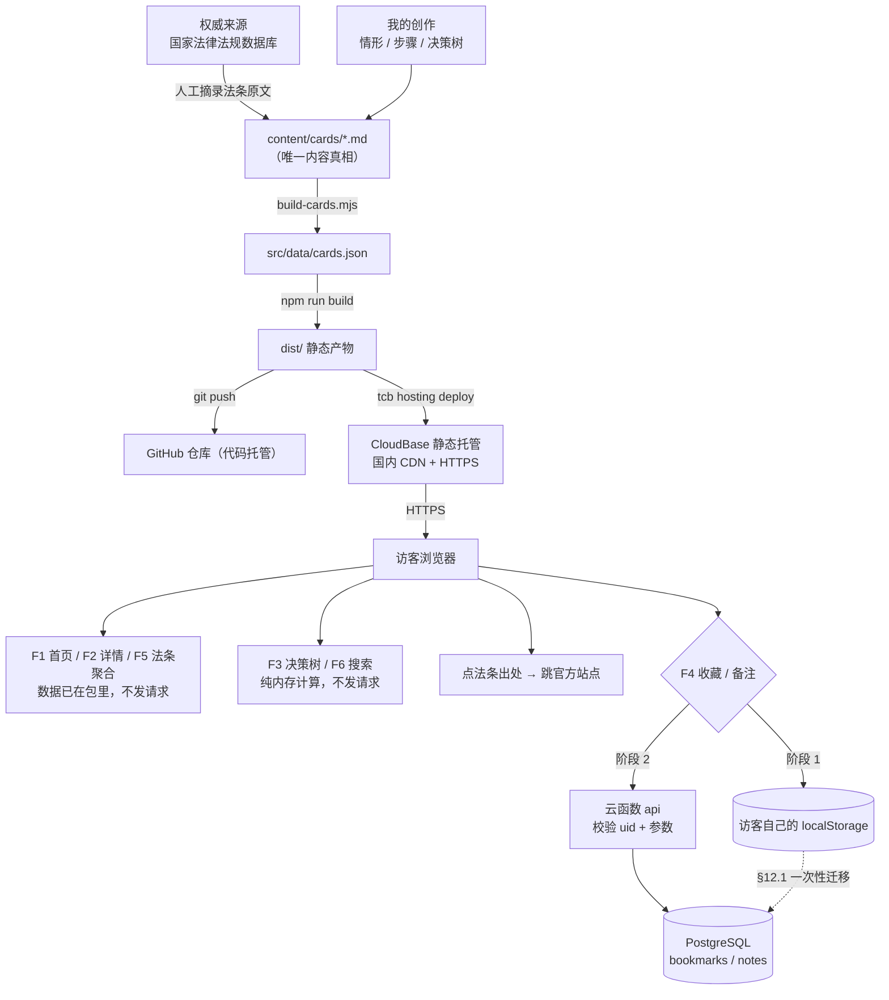

# TECH_DESIGN.md — 法律小科普轻站 V1 技术设计

> 第 1 周 · Day 5 技术设计文档 · **v2.0（含后端路线对比版）**
> 上游：`PRD.md`（Day 4）｜下游：目录与 UI 搭建（Day 6）、MVP 上线（Day 7）
> 上一版 v1.0（纯静态无后端）已保存在 git 提交 `2fa1ed1` 里，可随时 `git show 2fa1ed1:TECH_DESIGN.md` 回看。

**本文档的写作红线**：只做设计与对比，**不创建任何文件、不写代码**。文中出现的目录与文件名是 Day 6 动手时的依据，现在磁盘上并不存在。

---

## 0. 一句话说清：数据从哪来、到哪去

本站的数据有**两条完全不同的线**，必须分开说：

| | **内容线**（我产生的） | **用户数据线**（访客产生的） |
|---|---|---|
| 是什么 | 卡片、法条、决策树 | 收藏、备注 |
| 从哪来 | 国家法律法规数据库摘录 + 我写的 Markdown | 访客在页面上的点击与输入 |
| 到哪去 | 构建成数据 → 静态托管 CDN → 访客浏览器 | **阶段 1：只存访客自己的浏览器**<br>**阶段 2：经云函数写入 PostgreSQL，按匿名身份隔离** |

> **一句话**：内容从我的电脑来，经 CloudBase 静态托管的国内 CDN 送到访客眼前；访客产生的收藏和备注，**阶段 1 不出他自己的浏览器，阶段 2 才上云**，并且任何情况下都只对他自己可见。

---

## 1. 认知打底：前端 / 后端 / 数据库到底谁管什么

| 角色 | 住在哪 | 负责什么 | 打个比方 |
|------|--------|---------|---------|
| **前端** | 访客的浏览器 | 显示页面、响应点击、渲染列表 | 餐厅的**大堂和菜单** |
| **后端** | 服务商的服务器 | 校验参数、判断权限、读写数据 | 餐厅的**后厨** |
| **数据库** | 服务器上（后端旁边）| 长期保存数据（用户、收藏、内容）| 后厨的**仓库** |

**识别口诀**：凡是「**在别人电脑上替你保管东西**」的需求，才需要后端和数据库。
「把准备好的内容送到用户眼前」不需要；「用户下次换台设备还能看到自己收藏的卡片」就需要。

### 1.1 本站 7 个功能归谁管（分阶段）

| 功能 | 纯静态（阶段 1） | 接后端后（阶段 2） | 说明 |
|------|:---:|:---:|------|
| F1 情形清单 | 前端 | 前端 | 内容数据来自构建产物或只读接口，两种都行 |
| F2 详情页 | 前端 | 前端 | 同上 |
| F3 看情况选我做 | **前端** | **前端** | 决策树逻辑写死在客户端，**永远不发请求**（PRD §8.1 硬性验收）|
| F4 收藏 / 备注 | **前端 + localStorage** | **前端 + 云函数 + PostgreSQL** | 唯一需要后端的功能 |
| F5 法条聚合 | 前端 | 前端 | 页面加载时从数据源现算 |
| F6 搜索 | **前端** | **前端** | 在内存里做字符串匹配，**永远不发请求**（PRD §8.1 硬性验收）|
| F7 关于页 | 前端 | 前端 | 静态页面 |

> **两条硬约束（来自 PRD §8.1，不能被技术方案破坏）**：
> ① F3 决策树的每次点击、F6 搜索的每次输入，**Network 面板必须看不到任何请求**；
> ② F4 收藏/备注是**唯一**允许产生网络请求的用户功能。
> 这决定了后端的最小职责边界：**只承载 F4**，不要顺手把内容也改成接口，否则验收第 ① 条会挂。

---

## 2. 三套方案对比（本节是选型核心）

### 2.1 方案定义

| 代号 | 方案 | 一句话 |
|---|---|---|
| **A** | **GitHub Pages 纯静态** | 前端（HTML/CSS/JS 或 React）+ 内容静态烘焙 + GitHub Pages 托管，无后端无数据库，收藏存 localStorage |
| **B** | **CloudBase 一体化**（示范路线）| React/Vite + CloudBase 云函数（Node.js）+ CloudBase PostgreSQL + CloudBase 静态网站托管 |
| **C** | **Vercel/Netlify + Supabase** | React/Vite + Vercel 边缘函数 + Supabase（PostgreSQL + Auth），海外平台 |

### 2.2 八维对比总表

| 维度 | **A 纯静态** | **B CloudBase 一体化** | **C Vercel + Supabase** |
|------|------------|---------------------|----------------------|
| **① 前端** | HTML/CSS/JS；或 React/Vite | **React/Vite**（官方有 React Web 应用模板）| React/Vite |
| **② 后端** | 无 | **CloudBase 云函数（Node.js）**，HTTP 访问服务暴露 REST | Vercel Serverless / Edge Functions |
| **③ 数据库** | 无（浏览器 localStorage）| **CloudBase PostgreSQL**（上海地域 PG 版环境，兼容 Supabase 范式）| Supabase PostgreSQL |
| **④ 学习成本** | ⭐ 最低。只有 HTML/CSS/JS + git | ⭐⭐⭐ 最高。要同时理解：构建工具、云函数、SQL、鉴权、CDN 缓存 | ⭐⭐⭐ 高。概念与 B 类似，但文档为英文、社区答案偏英文 |
| **⑤ 线上持久化** | ❌ 无。换设备/清缓存即丢 | ✅ 有。数据在腾讯云，可演进为跨设备 | ✅ 有 |
| **⑥ 费用** | **0 元**（Pages 免费无额度上限）| 免费档 **3000 资源点/月**（≈¥3）；要绑自定义域名需升 **¥19.9/月** 个人版 | 免费档较好（Supabase 500MB PG + 免费额度），但国内访问要另付费 |
| **⑦ 排错难度** | ⭐ 最低。一个开发者工具面板搞定 | ⭐⭐⭐ 最高。**四层**：前端构建 → 云函数日志 → SQL 报错 → CDN 缓存 | ⭐⭐ 中高。日志体验好（Vercel 面板优秀），但网络问题难判断 |
| **⑧ 部署方案** | `git push` → 自动发布，约 1 分钟 | CLI（`tcb`）或控制台上传；静态托管 + 云函数要分别部署 | `git push` → 自动构建部署 |

### 2.3 逐维度展开（为什么这么打分）

**① 前端** — 三套都能用 React/Vite。差别不在前端，而在「谁来喂数据」。A 是构建时把数据打进包里，B/C 是运行时可能走接口。

**② 后端** — A 完全没有。B 用云函数，好处是**云函数能直接读到调用者身份**（CloudBase 身份认证的 uid 会随调用上下文传进来），不用自己实现一套 token 签发与校验，这对零基础是很大的省事。C 的 Serverless Function 需要自己处理 JWT 校验。

**③ 数据库** — CloudBase PG 的关键特性（已核实）：2026-08-10 正式支持；**兼容 Supabase 的范式**（PostgREST 自动 REST API + RLS 行级安全 + JWT）；支持 Database Branch（数据库秒级"分叉"，可以随便改 Schema 试错，失败就丢掉，不影响线上）。但官方明确声明**不承诺 100% API 兼容**，迁移不是零成本。

**④ 学习成本** — 从 A 到 B，多出来的东西是：`npm run build` 构建流程、云函数冷启动与日志、SQL 建表与索引、身份认证、CDN 缓存导致的"改了没生效"。对零基础的人来说，**这张清单里的每一项都会真实地卡住一次**。

**⑤ 线上持久化** — 这是 B/C 唯一真正赢过 A 的地方，但**必须先看清它的实际边界**：
- 阶段 2 用**匿名登录**，浏览器会拿到一个匿名 uid。数据存服务器了 ✅
- 但匿名 uid 本身也存在浏览器里，**清缓存/换设备同样会丢**，跨设备同步必须绑手机号或微信（属 PRD §4.1 的 V2）
- 所以持久化的真实价值是：**为 V2 账号体系提前把数据放在了服务端**，以及**改内容不必重新部署**，而不是"用户换手机还能看到收藏"

**⑥ 费用** — 实算见 §2.4。结论：B 的免费档对本站绰绰有余，但**真正会卡人的不是资源点，是域名**（见 §11.3）。

**⑦ 排错难度** — 这是最容易被低估的一维。A 出一个 bug，你打开浏览器 F12 就能看到原因。B 出一个 bug，可能是：前端代码错 / 云函数抛异常（要去控制台看日志）/ SQL 约束冲突 / CDN 缓存了旧文件——**四种原因、四个地方**。对还在学"怎么读报错"的阶段，这是实打实的成本。

**⑧ 部署方案** — A 最顺（push 即发布）。B 要区分静态资源和云函数两条部署链路，且**默认域名只适合开发测试**（见 §11.3）。

### 2.4 费用实算（含假设，请以控制台用量页为准）

计价基准：**1,000 资源点 ≈ ¥1**。资源点抵扣顺序：套餐资源点 → 资源包 → 按量计费。

**假设场景**：MVP 上线后小范围分享，月 2,000 次页面访问（PV），站点约 3 MB，100 个访客产生收藏/备注。

| 计量项 | 单价（官方） | 本次估算用量 | 折合资源点/月 |
|--------|------------|------------|-------------|
| 静态托管 · 流量 | 210 点/GB | 约 2 GB | ≈ 420 |
| 静态托管 · 存储 | 3.94 点/GB/天 | 3 MB × 30 天 | ≈ 0.4 |
| 云函数 · 调用次数 | 13.3 点/万次 | 约 0.45 万次 | ≈ 6 |
| 云函数 · 资源使用量 | 0.11108 点/GBs | 约 135 GBs | ≈ 15 |
| 云函数 · 外网出流量 | 800 点/GB | 约 9 MB | ≈ 7 |
| 身份认证 · 调用次数 | 500 点/万次 | 约 0.2 万次 | ≈ 100 |
| PG · CPU 使用量 | 342 点/核·小时 | 约 0.5 核·小时 | ≈ 171 |
| PG · 容量 | 0.5 点/GB/小时 | 约 0.05 GB | ≈ 18 |
| **合计** | | | **≈ 740 点/月（≈ ¥0.74）** |

**结论**：
- 免费档 **3,000 点/月** 覆盖本站有余量，**月 PV 一万以内基本不用花钱**
- 免费档**不支持**加购资源包与按量付费。超出后会怎样（限流 / 停服 / 仅告警）官方文档未明确说明 → 列入 §13 待确认
- 真正花钱的是**域名与备案**（§11.3），不是这些资源点

### 2.5 每套方案的「致命短板」各一条

| 方案 | 如果只能记一条短板 |
|---|---|
| **A** | **国内访问不稳定**。`*.github.io` 的域名解析在国内长期不稳定，而本站目标用户是「80% 手机端、微信扫一扫」的普通人——点开是白屏，前功尽弃 |
| **B** | **免费档绑不了自定义域名**。默认域名（`*.tcloudbaseapp.com`）会弹「仅供开发测试」的访问中间页，分享给朋友会先看到这个提示；要去掉它必须升级到个人版（¥19.9/月）并完成 ICP 备案（1–20 个工作日） |
| **C** | **面向国内用户不成立**。Vercel / Supabase 在国内访问需要额外网络手段，且无法完成 ICP 备案，等于把 A 的问题换个形式重演 |

---

## 3. 默认路线推荐

### 3.1 推荐结论（一句话）

> ## 🧭 默认走 **方案 B（CloudBase 一体化）**，但**分两阶段落地**：
> **阶段 1（Day 6–7）** 用 React/Vite + CloudBase 静态网站托管上线，内容构建时烘焙进包，**收藏/备注先用 localStorage**；
> **阶段 2（Day 8 之后）** 再开启 **云函数 + PostgreSQL + 匿名登录**，把收藏/备注搬到线上。
> 前端形态从第一天起就是最终形态，**阶段 2 不需要返工页面**，只替换一个数据访问层。

### 3.2 为什么推荐它（5 条理由）

1. **部署平台一次选定，不二次折腾。** A 的问题是"国内用户点不开"，而这不是靠优化能解决的——是域名可达性的问题。既然迟早要换，不如第一天就用国内 CDN。
2. **满足 PRD 的 V2 演进路径。** PRD §4.1 把账号系统放在 Day 22–28，方案 B 的阶段 2 正好是它的前置条件：数据已经在服务端，将来加手机号/微信登录只是"绑定"，不是"搬迁"。
3. **前端不返工。** 关键设计是 §5 里的 `src/data/dataSource.js`——**唯一的数据访问层**。它有两个实现（`localAdapter` / `apiAdapter`），阶段 1 和阶段 2 只换这一处，页面组件一行不改。
4. **Day 7 的时间点不会被后端拖累。** 阶段 1 不含后端，所以"要建表、要配鉴权、要调 SQL"这些都会卡人的事，全都被推到 MVP 上线之后。**先上线，再加后端**，而不是反过来。
5. **官方有 React/Vite 模板 + MCP/Skills/CLI 工具链**，AI 能直接操作 CloudBase（建表、配权限、部署），这对 Vibe Coding 的学习方式是顺路的。

### 3.3 取舍清单（明确放弃了什么）

| 得到了 | 放弃了 |
|--------|--------|
| 国内可访问的 CDN | GitHub Pages 的"零配置"——要装 CLI、要学构建产物上传 |
| 收藏/备注可上云（阶段 2）| 零排错成本——从 1 层变成 4 层 |
| 数据可演进为账号体系 | 免费档"无中间页"的干净体验（要么忍中间页，要么花 ¥19.9/月 + 备案）|
| 内容与页面解耦 | 简单直接的 `<script>` 引用，改成 `npm run build` 构建流程 |
| 长期成本可控 | 短期学习曲线更陡：要懂 SQL 与云函数日志 |

### 3.4 两阶段落地表

| | **阶段 1（Day 6–7）** | **阶段 2（Day 8+）** |
|---|---|---|
| 前端 | React + Vite + react-router，原生 CSS | 不变 |
| 内容数据 | 构建时烘焙成 JSON 打进 bundle | 可保持不变，或切只读接口 |
| 后端 | **无** | 云函数 `api`（Node.js） |
| 数据库 | **无** | PostgreSQL（`cards` / `law_refs` / `bookmarks` / `notes`）|
| 收藏/备注 | localStorage | 云函数 + PG，匿名登录 |
| 部署 | `tcb hosting deploy` | 静态托管 + `tcb fn deploy` |
| 产生网络请求的功能 | **0 个**（F3/F6 天然纯前端）| 仅 F4 |
| PRD 验收影响 | 完全符合 §8.1 / §8.3 | 需按 §12.1 修订 §8.3 措辞 |

### 3.5 一票否决项：什么情况下应该改回方案 A

出现下面任一条，就直接退回纯静态，别纠结：

- 你觉得「React 构建流程」本身已经吃力，再加云函数和 SQL 会拖垮进度 → **先上线比架构正确重要**
- 你的用户其实就是班里的同学和老师（都在能访问 GitHub 的网络环境）→ A 的致命短板不成立
- Day 7 截止前剩余时间不足 3 天 → 切 A，把 CloudBase 留到 Day 8 之后补

---

## 4. 选定方案的技术栈清单

| 层 | 选择 | 版本/形态 | 为什么不选替代品 |
|---|---|---|---|
| 前端框架 | **React + Vite** | JS（**不上 TypeScript**）| 不上 TS 是为了少一层类型报错的学习成本 |
| 路由 | react-router-dom | SPA 客户端路由 | 页面少，不引入更重的方案 |
| 样式 | **原生 CSS + CSS 变量** | 沿用 PRD §5.2 的设计 token | 不上 Tailwind：零基础时"类名地狱"比写 CSS 更难查 |
| 状态管理 | React 内置 `useState` / `useContext` | 不引入 Redux | 状态量极小 |
| 后端 | **CloudBase 云函数** | Node.js，HTTP 访问服务 | 不选云托管（容器）：本站并发低，函数足够且更省 |
| 数据库 | **CloudBase PostgreSQL** | 上海地域 · PG 版环境 | 不选文档型：收藏/备注是强关系数据，且 PG 兼容 Supabase 便于未来 |
| 鉴权 | **CloudBase 身份认证 · 匿名登录** | 阶段 2 启用 | 不自己实现 JWT：自己写 token 是安全漏洞高发区 |
| 静态托管 | **CloudBase 静态网站托管** | 国内 CDN + HTTPS | 不选 GitHub Pages：见 §2.5 |
| 内容生产 | Markdown（`content/cards/*.md`）+ 构建脚本 | Node 脚本汇总为 JSON | 保住"内容/页面分离"这个最重要的结构性决定 |
| 版本管理 | Git + GitHub | 仓库不变 | 部署换平台 ≠ 代码托管换平台，两者无关 |

---

## 5. 项目结构（Day 6 按这个建，本文档不创建文件）

```
Vibe Coding/                          ← 项目根（桌面文件夹）
├── index.html                        # Vite 入口 HTML（SPA 唯一 HTML）
├── package.json                      # 依赖与脚本（dev / build / deploy）
├── vite.config.js                    # 构建配置（注意 base 路径）
├── .env.example                      # ★ 可提交：只放变量名与说明，不放真值
├── .env.local                        # ★ 不提交：本地真值（.gitignore 已覆盖）
├── .gitignore                        # 已有，已覆盖 .env.local / dist/ / node_modules/
│
├── src/
│   ├── main.jsx                      # 挂载入口
│   ├── App.jsx                       # 布局 + ErrorBoundary
│   ├── router.jsx                    # 6 个页面路由
│   ├── pages/
│   │   ├── HomePage.jsx              # P1 情形清单 + 搜索（F1 / F6）
│   │   ├── ArticlePage.jsx           # P2 详情页（F2 / F3 / F4）
│   │   ├── LawsPage.jsx              # P3 法条聚合（F5）
│   │   ├── BookmarksPage.jsx         # P4 我的收藏（F4）
│   │   ├── AboutPage.jsx             # P5 关于 + 免责声明（F7）
│   │   └── NotFoundPage.jsx          # V3 兜底
│   ├── components/
│   │   ├── CardList.jsx              # 卡片列表
│   │   ├── DecisionTree.jsx          # F3 决策树（纯前端）
│   │   ├── SearchBox.jsx             # F6 搜索（纯前端）
│   │   ├── BookmarkButton.jsx        # F4 收藏按钮
│   │   ├── NoteEditor.jsx            # F4 备注编辑
│   │   └── SiteFooter.jsx            # 免责声明（每页都有，PRD §8.3）
│   ├── data/
│   │   ├── dataSource.js             # ★★ 唯一数据访问层（阶段切换只改这里）
│   │   ├── localAdapter.js           # 阶段 1：localStorage 实现
│   │   ├── apiAdapter.js             # 阶段 2：云函数实现
│   │   └── cards.json                # 构建产物：内容数据（由下面脚本生成）
│   ├── lib/
│   │   ├── tcb.js                    # CloudBase SDK 初始化 + 登录（阶段 2）
│   │   ├── errors.js                 # 错误码 → 用户可读文案
│   │   └── storage.js                # localStorage 安全包装（处理禁用情况）
│   └── styles/
│       ├── tokens.css                # 颜色 / 字号 / 间距变量
│       └── global.css                # 全局样式与响应式断点
│
├── content/
│   └── cards/                        # 内容源：每张卡一个 .md（唯一的内容真相）
│       ├── qiye-cuidui.md
│       ├── tuizu-yajin.md
│       └── ...
├── scripts/
│   └── build-cards.mjs               # content/*.md → src/data/cards.json
│
├── cloudfunctions/                   # 阶段 2 才启用
│   └── api/
│       ├── index.js                  # 入口：路由分发
│       ├── routes/
│       │   ├── cards.js              # 内容只读接口
│       │   └── me.js                 # 收藏 / 备注接口
│       ├── services/
│       │   ├── db.js                 # PG 访问封装
│       │   └── auth.js               # 取当前 uid（来自云函数调用上下文）
│       └── package.json
│
├── db/                               # 阶段 2：SQL 版本化（只存脚本，不存数据）
│   ├── schema.sql                    # 建表
│   ├── policies.sql                  # RLS 权限策略
│   └── seed.sql                      # 初始内容（可选）
│
└── （已有文档，保留在根目录）AGENTS.md / research.md / PRD.md / TECH_DESIGN.md
```

**两点说明**：
1. `.env`（当前仓库根目录那个占位文件）继续只放占位内容、继续被忽略。真实配置**永远只放 `.env.local`**。
2. 文档（`AGENTS.md` / `research.md` / `PRD.md` / `TECH_DESIGN.md`）**保留在根目录**，不挪进 `docs/`——避免无意义的路径变更。但构建时要确保它们**不进 `dist/`**（见 §12.4）。

---

## 6. 数据对象及字段（对齐 PRD §6）

### 6.1 关系图

```
cards (卡片) 1 ──── N law_refs (法条引用)
   │
   │  (通过 card_id 被引用，不设外键到 bookmarks/notes，因为卡片可能下架)
   │
   ├── N bookmarks (收藏)  ── 每个 uid 对每张卡最多 1 条
   └── N notes     (备注)   ── 每个 uid 对每张卡最多 1 条
```

### 6.2 表定义

**表 1：`cards`（卡片主表）**

| 字段 | 类型 | 约束 | 对应 PRD §6.1 |
|------|------|------|--------------|
| `id` | uuid | PK, default gen_random_uuid() | `id` |
| `slug` | text | **UNIQUE**, NOT NULL | `slug` |
| `title` | text | NOT NULL, ≤30 字 | `title` |
| `summary` | text | NOT NULL, ≤60 字 | `summary` |
| `category` | text | NOT NULL, CHECK in 6 类 | `category` |
| `tags` | text[] | NOT NULL default '{}' | `tags` |
| `scenario` | text | NOT NULL, ≤150 字 | `scenario` |
| `solution_steps` | jsonb | NOT NULL, 数组长度 ≤3 | `solution_steps` |
| `decision_tree` | jsonb | NOT NULL | `decision_tree` |
| `related_slugs` | text[] | NOT NULL, 长度 3–5 | `related_articles` |
| `author_type` | text | NOT NULL | `author_type` |
| `reviewed_by` | text | NOT NULL | `reviewed_by` |
| `status` | text | NOT NULL, CHECK in draft/published/archived | `status` |
| `published_at` | timestamptz | NOT NULL | `published_at` |
| `updated_at` | timestamptz | NOT NULL | `updated_at` |

**表 2：`law_refs`（法条引用，PRD §6.2）**

| 字段 | 类型 | 约束 |
|------|------|------|
| `id` | uuid | PK |
| `card_id` | uuid | FK → cards(id) ON DELETE CASCADE |
| `law_name` | text | NOT NULL |
| `article_no` | text | NOT NULL |
| `content` | text | NOT NULL, ≤200 字 |
| `source_url` | text | NOT NULL（必须是官方源，PRD §8.3）|
| `effective_date` | date | NULL 允许 |
| `sort_order` | int | NOT NULL default 0 |
| （唯一约束）| | UNIQUE(card_id, law_name, article_no) |

**表 3：`bookmarks`（收藏）**

| 字段 | 类型 | 约束 |
|------|------|------|
| `id` | uuid | PK |
| `uid` | text | NOT NULL（来自云函数上下文的匿名用户 ID，**不接受前端传入**）|
| `card_id` | uuid | NOT NULL |
| `created_at` | timestamptz | NOT NULL default now() |
| （唯一约束）| | **UNIQUE(uid, card_id)** ← 保证重复点击不会产生重复收藏 |

**表 4：`notes`（备注，PRD §6.4 的 `notes:<article_id>` 升级版）**

| 字段 | 类型 | 约束 |
|------|------|------|
| `id` | uuid | PK |
| `uid` | text | NOT NULL |
| `card_id` | uuid | NOT NULL |
| `content` | text | NOT NULL, **CHECK (char_length(content) <= 500)** ← 长度在数据库层兜底 |
| `created_at` | timestamptz | NOT NULL default now() |
| `updated_at` | timestamptz | NOT NULL default now() |
| （唯一约束）| | **UNIQUE(uid, card_id)** ← 一卡一备注，写入用 ON CONFLICT 覆盖 |

**表 5：`schema_migrations`（可选但推荐）** — 记录哪个 SQL 脚本已执行，避免重复建表报错。

### 6.3 阶段 1 的本地数据结构（对齐 PRD §6.4）

阶段 1 还没数据库，先按同一套形状存在浏览器里，**阶段 2 迁移时字段一一对应，零转换**：

| localStorage Key | 类型 | 对应阶段 2 |
|------------------|------|-----------|
| `bookmarks` | string[]（slug 列表）| `bookmarks` 表的行 |
| `notes:<slug>` | string（≤500 字）| `notes` 表的行 |
| `bookmarks_updated_at` | ISO 字符串 | 用于导出与迁移判断 |

### 6.4 索引与性能（12 张卡的量级下只需 3 个）

- `cards(slug)` UNIQUE —— 详情页按 slug 查
- `cards(status, published_at DESC)` —— 首页列表
- `bookmarks(uid)` / `notes(uid)` —— 我的收藏页

> 12 张卡、100 个用户的量级，**任何索引都不是性能问题**，写这三个只是为了养成习惯。

---

## 7. API 列表

### 7.1 通用约定

| 项 | 约定 |
|---|---|
| Base URL | `https://<envId>.service.tcloudbase.com/api`（HTTP 访问服务域名；阶段 2 之前为空）|
| 版本 | 路径不带版本号，靠字段演进；新增字段必须可选 |
| 鉴权 | 内容接口公开；`/api/me/*` 必须携带 CloudBase 登录态。<br>**uid 由云函数从调用上下文读取，前端传的 uid 一律忽略** |
| 响应包 | 统一为 `{ "code": 0, "message": "ok", "data": {...}, "requestId": "..." }` |
| 幂等 | 收藏用 `UNIQUE(uid, card_id)` + `ON CONFLICT DO NOTHING`；备注用 `ON CONFLICT DO UPDATE` |
| 时间格式 | 一律 ISO 8601（`2026-09-20T15:00:00+08:00`）|
| 分页 | V1 数据量小，列表接口不分页；返回全量并附 `total` |
| 缓存 | 内容接口允许 CDN 缓存 60 秒；`/api/me/*` **禁止缓存**（`Cache-Control: no-store`）|

### 7.2 内容接口（只读，公开）

| # | 方法 | 路径 | 说明 | 主要响应字段 | 阶段 |
|---|---|---|---|---|---|
| 1 | GET | `/api/health` | 健康检查（部署后第一件事就是打这个）| `{ ok, version, dbConnected }` | 2 |
| 2 | GET | `/api/cards` | 全部已发布卡片列表（首页 F1）| `[{ slug, title, summary, category, tags, published_at }]` | 2 |
| 3 | GET | `/api/cards/{slug}` | 单卡详情（F2 / F3）| `{ ...card, laws: [...], decision_tree: {...}, related: [...] }` | 2 |
| 4 | GET | `/api/laws` | 法条聚合（F5），返回按 `law_name` 分组 | `[{ law_name, articles: [{ article_no, content, source_url, referenced_by: [slug] }] }]` | 2 |

> **阶段 1 时这些接口不存在**，前端直接从 `src/data/cards.json` 读同一份结构。`dataSource.js` 屏蔽这个差异。

### 7.3 用户数据接口（需登录）

| # | 方法 | 路径 | 说明 | 请求体 | 成功响应 |
|---|---|---|---|---|---|
| 5 | GET | `/api/me/bookmarks` | 我的收藏（F4）| — | `{ total, items: [{ slug, title, summary, created_at }] }` |
| 6 | POST | `/api/me/bookmarks` | 收藏一张卡 | `{ cardId }` | `{ slug, created_at }` |
| 7 | DELETE | `/api/me/bookmarks/{cardId}` | 取消收藏 | — | `{ removed: true }` |
| 8 | GET | `/api/me/bookmarks/export` | 导出收藏（PRD §3.4 要求）| — | `{ exported_at, bookmarks: [...], notes: {...} }` |
| 9 | GET | `/api/me/notes/{cardId}` | 读备注 | — | `{ content, updated_at }` |
| 10 | PUT | `/api/me/notes/{cardId}` | 写/改备注 | `{ content }` | `{ content, updated_at }` |
| 11 | DELETE | `/api/me/notes/{cardId}` | 删备注 | — | `{ removed: true }` |

### 7.4 错误码表（与 PRD §7 异常状态对齐）

| code | HTTP | 含义 | 前端表现（对应 PRD §7）|
|---|---|---|---|
| `0` | 200 | 成功 | 正常 |
| `40001` | 400 | 参数缺失或格式错误 | 「操作没成功，请重试」 |
| `40002` | 400 | 卡片不存在或已下架 | 「这篇卡片暂时无法显示」（PRD 404 行）|
| `40003` | 400 | 备注超过 500 字 | 「备注最多 500 字」（PRD §3.4）|
| `40100` | 401 | 未登录 / 登录态失效 | 静默重新匿名登录，重试 1 次 |
| `40300` | 403 | 无权访问他人数据 | 按「数据不存在」处理，不泄露存在性 |
| `42900` | 429 | 请求过于频繁 | 「操作太快了，稍等一下」 |
| `50000` | 500 | 服务内部错误 | 「出了点问题，请稍后重试」+ 展示 requestId |
| `50300` | 503 | 数据库不可用 | 「服务暂时不可用，请稍后再试」 |

---

## 8. 数据流

### 8.1 三条线（文字版）

```
═══════════ 线 1：内容从哪来（在我的电脑上，用户看不到）═══════════

  【权威来源】                         【我的创作】
  国家法律法规数据库                    每张卡片一个 .md
  flk.npc.gov.cn                      content/cards/*.md
        │                                    │
        │ 人工摘录法条原文                      │ 写：情形 / 步骤 / 决策树
        ▼                                    ▼
   ┌──────────────────────────────────────────────────┐
   │  cards/*.md（头部字段 + 正文 + 法条 + 决策树 YAML）  │
   └──────────────────────────────────────────────────┘
                          │
                          │ node scripts/build-cards.mjs
                          ▼
               ┌──────────────────────────┐
               │  src/data/cards.json      │  ← 前端唯一内容数据源
               └──────────────────────────┘
                          │
                          │ npm run build
                          ▼
                    dist/（静态产物）

═══════════ 线 2：内容怎么送到用户眼前 ═══════════

  我的电脑            Git 仓库            CloudBase 静态托管         访客浏览器
  ┌────────┐ git push ┌────────┐  发布  ┌──────────────┐   HTTPS   ┌──────────┐
  │ dist/  │ ───────► │ GitHub │ ─────► │ 国内 CDN 节点 │ ────────► │ 打开网页  │
  └────────┘          └────────┘        └──────────────┘           └────┬─────┘
                                                                        │
    ┌───────────────────────────────────────────────────────────────────┤
    ▼                          ▼                    ▼                   ▼
 F1 首页渲染             F6 搜索（内存匹配）    F3 决策树（本地算）   点法条 → 跳官方源
 （数据已在包里，        【不发请求】          【不发请求】          （离开本站）
   不发请求）

═══════════ 线 3：用户数据去哪 ═══════════

  【阶段 1 · Day 6–7】                【阶段 2 · Day 8+】
                                     ┌──────────────────────────────┐
  访客点「收藏」/写「备注」              │ ① CloudBase 匿名登录 → 拿到 uid │
        │                            └──────────────┬───────────────┘
        ▼                                           ▼
  ┌──────────────────┐                   ┌──────────────────────┐
  │ 他自己的           │                   │ ② 调云函数 /api/me/*  │
  │ localStorage      │                   └──────────┬───────────┘
  └──────────────────┘                              ▼
        │                              ┌──────────────────────────┐
        │ 不清缓存就一直在                 │ ③ 云函数校验 uid + 参数    │
        │                              └──────────┬───────────────┘
        │                                         ▼
        │                              ┌──────────────────────────┐
        │                              │ ④ PostgreSQL             │
        │                              │   bookmarks / notes      │
        │                              │   （UNIQUE(uid,card_id)）│
        │                              └──────────────────────────┘
        │                                         │
        └──────── 迁移动作：读 localStorage ──────►│  一次性上传后清空本地
                  （见 §12.1）                     ▼
                                        其他访客永远读不到（RLS + 云函数双重隔离）
```

### 8.2 Mermaid 版（GitHub 网页会渲染成图）



### 8.3 关键时序：收藏一次点下去，发生了什么（阶段 2）

```
用户          前端                    云函数                 PostgreSQL
 │             │                       │                      │
 │ 点击「收藏」  │                       │                      │
 ├────────────►│                       │                      │
 │             │ ① 乐观更新 UI：         │                      │
 │  ← 立刻看到「已收藏 ✓」               │                      │
 │             │ ② POST /api/me/bookmarks                     │
 │             ├──────────────────────►│                      │
 │             │                       │ ③ 从调用上下文取 uid    │
 │             │                       │   （不信前端传的）      │
 │             │                       │ ④ 校验 cardId 存在     │
 │             │                       ├─────────────────────►│
 │             │                       │  INSERT ... ON CONFLICT
 │             │                       │◄─────────────────────┤
 │             │  200 { code:0 }        │                      │
 │             │◄──────────────────────┤                      │
 │             │ ⑤ 确认状态（无变化）     │                      │
 │             │                       │                      │
 │   【如果 ② 失败】                     │                      │
 │             │ ◄── 回滚 UI 为「未收藏」+ 提示「收藏失败，请重试」  │
 │   ← 看到失败提示与重试按钮              │                      │
```

**关键设计**：**先改界面，再发请求；请求失败就回滚**（乐观更新）。理由是「点一下等一秒才变色」的体感很差；但**回滚必须实现**，否则用户会以为收藏成功了，实际没存——这是比慢更严重的问题（PRD §8.3 要求收藏状态必须真实）。

---

## 9. 错误处理

### 9.1 前端

| 场景 | 处理 |
|---|---|
| 组件渲染崩溃 | 顶层 `ErrorBoundary` 兜底，显示「页面出错了 + 刷新按钮」，不让白屏 |
| 接口失败 | 统一走 `lib/errors.js`：错误码 → 中文文案；未知错误兜底为「出了点问题，请稍后重试」 |
| 收藏/备注写入失败 | **乐观更新 + 回滚**（见 §8.3），并保留用户输入内容，不清空 |
| 登录态失效（40100）| 静默重新匿名登录并重试 1 次；仍失败则提示「请刷新页面」 |
| 网络不可用 | 监听 `navigator.onLine`；离线时禁用收藏/备注并提示「当前网络不可用，内容仍可阅读」 |
| 请求超时 | 8 秒超时；读接口自动重试 2 次（指数退避 300ms / 900ms），**写接口不自动重试**（避免重复写入）|
| localStorage 不可用（PRD §7）| `lib/storage.js` 里 try/catch 探测；不可用时收藏按钮 hover 提示「需允许浏览器存储才能使用收藏」 |
| JS 禁用（PRD §7）| `<noscript>` 提示 + 关键内容文本可读（React SPA 下仅能提示，属已知代价）|

### 9.2 后端（云函数）

| 场景 | 处理 |
|---|---|
| 参数校验 | 入口统一校验：`cardId` 必须是合法 uuid；`content` 长度 ≤500；缺失即返回 40001，不进数据库 |
| 身份校验 | uid **只从云函数调用上下文取**；取不到直接 40100。`/api/me/*` 不接受任何前端的 uid 参数 |
| 越权 | 所有查询强制带 `WHERE uid = $1`；**绝不提供"按 cardId 查所有用户备注"这类接口** |
| 数据库写入冲突 | 用 `ON CONFLICT` 显式处理，不靠捕获异常 |
| 数据库不可用 | 连接失败重试 2 次（1s / 3s）后返回 50300，并记 error 日志 |
| 未捕获异常 | 最外层 try/catch，返回 50000 + `requestId`，**不把堆栈返回给前端** |
| 频率限制 | 单 uid 每分钟写操作上限（如 30 次），超出返回 42900 |
| 日志 | 每条日志带 `requestId` / `uid`（脱敏）/ `path` / `耗时`；**不打印备注正文**（涉及个人隐私）|

### 9.3 数据一致性

- **收藏**：`UNIQUE(uid, card_id)` 是最终防线。即使前端连点 5 次，数据库里也只有 1 条
- **备注**：`UNIQUE(uid, card_id)` + `ON CONFLICT DO UPDATE`，天然幂等
- **导出**：`/api/me/bookmarks/export` 只读，不产生副作用
- **删除**：卡片下架（`status = archived`）时，**不级联删用户的收藏和备注**，只在展示时过滤（避免用户数据被"技术操作"丢掉）

### 9.4 与 PRD §7 九种异常状态的对照

| PRD §7 异常 | 本方案的落地位置 |
|---|---|
| 404 URL 不存在 | 前端路由 `NotFoundPage`（V3）+ SPA 重定向规则（§11.1 第 6 步）|
| 500 资源加载失败 | ErrorBoundary + 静态资源失败提示 |
| 空数据 1（无收藏）| `BookmarksPage` 空态：「还没有收藏，去首页看看吧」|
| 空数据 2（搜索无命中）| `SearchBox` 空态：「没找到，试试搜『借条』或『合同』」|
| 空数据 3（无相关拓展）| `related_slugs` 为空时显示「更多内容正在准备中」|
| 断网 | `navigator.onLine` 监听 + 内容仍可读 |
| localStorage 不可用 | `lib/storage.js` 探测 + 提示 |
| 法条链接失效 | 跳转前提示「此链接可能已失效，请以法律原文为准」|
| JS 禁用 | `<noscript>` 提示（已知代价，见 §9.1）|

---

## 10. 环境变量

### 10.1 前端（Vite，构建时注入）

> ⚠️ **铁律**：`VITE_` 前缀的变量会被**打包进 JS 文件，公开可读**。所以这里**只准放公开标识，绝不放密钥**。

| 变量名 | 示例 | 说明 | 敏感性 |
|---|---|---|---|
| `VITE_TCB_ENV_ID` | `week01-prod-8g3k` | CloudBase 环境 ID | 公开（本来就会出现在前端代码里）|
| `VITE_API_BASE_URL` | `https://xxx.service.tcloudbase.com/api` | 云函数 HTTP 访问地址 | 公开 |
| `VITE_DATA_SOURCE` | `local` / `api` | ★ 阶段开关：决定 `dataSource.js` 用哪个适配器 | 公开 |
| `VITE_APP_VERSION` | `1.0.0` | 版本号，展示在页脚便于排错 | 公开 |

### 10.2 后端（云函数，服务端运行）

> 这些**只存在于服务端**，前端永远看不到。

| 变量名 | 说明 | 敏感性 |
|---|---|---|
| `TCB_ENV_ID` | 云函数所在环境 ID | 低 |
| `PG_CONNECTION_STRING` | PostgreSQL 连接串（**若用官方内置 SDK 可不需此项**）| **🔴 高，绝不外泄** |
| `NOTE_MAX_LEN` | `500`，与数据库 CHECK 保持一致 | 低 |
| `RATE_LIMIT_PER_MIN` | `30`，单 uid 写操作频率上限 | 低 |
| `LOG_LEVEL` | `info` / `debug` | 低 |
| `ALLOWED_ORIGIN` | 允许的前端域名（CORS 白名单）| 低 |

### 10.3 三个存放位置与红线

| 位置 | 放什么 | 提交到 Git 吗 |
|---|---|---|
| `.env.example` | **只有变量名和说明，值留空** | ✅ 提交（给未来的自己看的模板）|
| `.env.local` | 本地真实值 | ❌ **绝不提交**（`.gitignore` 第 3 行已覆盖）|
| CloudBase 控制台 · 云函数配置 · 环境变量 | 线上真实值 | ❌ 不进 Git，在控制台填 |

**现状检查**：当前 `.gitignore` 已覆盖 `.env` / `.env.local` / `.env.*.local` / `*.key` / `*.pem` / `node_modules/` / `dist/` / `build/`，本方案所需的忽略规则**已经齐了**，无需改动。
建议（非必须）补充：`.tcb/`（CloudBase CLI 本地缓存）、`*.tsbuildinfo`、`.cache/`。

---

## 11. 部署

### 11.1 首次部署 7 步（阶段 1，Day 7）

| 步 | 做什么 | 成功现象 |
|---|---|---|
| 1 | 腾讯云账号完成实名认证，领免费体验版环境兑换码并创建环境 | 控制台能看到环境 ID |
| 2 | 创建环境时**地域选上海**（国内用户）、数据库类型按阶段 2 需要选择 | 环境状态「正常」 |
| 3 | 本地 `npm install` → `npm run build` | `dist/` 目录生成，里面有 `index.html` 和 `assets/` |
| 4 | 安装 CloudBase CLI（`tcb`）并登录 | `tcb env list` 能列出你的环境 |
| 5 | `tcb hosting deploy dist -e <envId>` | 控制台「静态网站托管 → 应用部署列表」出现记录，状态「成功」|
| 6 | **配置 SPA 路由回退**：在静态托管的路由/重定向规则里，把未知路径重定向到 `/index.html` | 直接访问 `/<任意子路由>` 并刷新，不出现 404 |
| 7 | 用默认域名打开首页，把 `curl -I` 与浏览器都验证一遍 | 首页 200；子路由刷新 200；静态资源 200 |

> **第 6 步是最容易漏、也最容易误判的一步。** 本站 P2 详情页是 `/article/:slug` 这种深链（可能被微信里转发），不配回退规则，用户刷新就是 404。

### 11.2 日常发布

| 发布内容 | 命令 | 生效时间 |
|---|---|---|
| 只改前端/内容 | `npm run build && tcb hosting deploy dist -e <envId>` | 约 1 分钟 |
| 只改云函数 | `tcb fn deploy api -e <envId>` | 约 1 分钟 |
| 改数据库结构 | 在 `db/schema.sql` 里追加，执行迁移 | 立即 |

**缓存注意**（官方文档实测坑）：
- `index.html` 建议 **1 小时** 缓存（配长了会导致发新版后用户仍加载旧 JS）
- 带 hash 的 `assets/*.js` / `*.css` 可设 **7 天**
- 图片字体可设 **30 天**
- 缓存规则变更后约 **1–3 分钟**生效，期间看到旧配置属正常

### 11.3 域名与备案的现实（最容易踩的坑）

**官方文档明确写了，默认域名（`*.tcloudbaseapp.com`）只能用于开发测试**：

- 通过浏览器直接访问默认域名时，会**先显示一个「访问提示中间页」**，访客必须点「确定访问」才能进入真实页面
- 平台会对默认域名的访问量做实时监控，**访问量异常时保留禁止访问的权力**
- 官方建议：正式面向用户必须配置**自定义域名**

**而去掉中间页（即绑定自定义域名）的前置条件**：

| 前置条件 | 说明 | 对我们的影响 |
|---|---|---|
| 域名完成 **ICP 备案** | 面向中国大陆访问的自定义域名必须备案 | 1–20 个工作日 |
| 套餐为**个人版及以上** | **免费体验环境不支持备案** | **必须升到 ¥19.9/月** |
| 环境剩余有效期 > 6 个月 | 免费环境单次续期 6 个月，卡在边界上 | 需注意续期时间 |
| 已开启「云托管固定 IP」 | 备案的准入条件之一 | 需在控制台开启 |

> **结论（必须让用户知道）**：
> - **课程作业 / 演示阶段**：用默认域名 + 中间页，**免费**，可以接受
> - **正式对外**：需要 **¥19.9/月 + 备案 1–20 个工作日 + 一个已购买的域名**
> - 如果 Terry 暂时不愿为域名花钱也懒得备案，那么 **方案 A（GitHub Pages）的"没有中间页"反而是优点**，只是国内可达性差——这是一个需要他本人拍板的权衡，见 §13 问题 3

### 11.4 回滚

| 要回滚什么 | 怎么做 |
|---|---|
| 前端 | 静态托管支持部署版本列表 → 重新部署上一个版本的产物；或本地 `git checkout <旧提交>` 后重新构建部署 |
| 云函数 | 云函数支持版本管理 → 切回旧版本 |
| 数据库 | 免费档**没有**数据回档（数据回档 14 天是 ¥199/月标准版的能力）→ 所以**写入前先想清楚**，实验用 Database Branch |

---

## 12. 迁移注意事项

### 12.1 阶段 1 → 阶段 2（localStorage → PostgreSQL）

这是本项目**唯一真正会动的迁移**。按下面顺序做，不会丢数据：

1. 先部署好云函数，用 `/api/health` 确认通
2. 前端加一个**一次性的迁移函数**：读 `localStorage.bookmarks` 和 `notes:*`，逐条调 `POST /api/me/bookmarks` 与 `PUT /api/me/notes/{cardId}`
3. **上传成功后再清空本地**（失败就保留，下次再试）——顺序反了就会丢数据
4. 在 localStorage 写一个 `migrated_v2 = true` 标记，避免重复迁移
5. 把 `dataSource.js` 的适配器从 `localAdapter` 切到 `apiAdapter`（**只改这一处**）
6. 迁移期间让"本地版"和"云端版"能共存读取（并集），迁完再移除本地读取

**注意**：阶段 2 用匿名登录后，不同的浏览器/设备会拿到不同的匿名 uid，**迁移必须在同一台设备、同一个浏览器里做**。

### 12.2 GitHub Pages → CloudBase 静态托管

如果将来要把仓库同时发布到 GitHub Pages（比如给老师看），注意 **Vite 的 `base` 路径不同**：

| 平台 | `vite.config.js` 的 `base` | 访问路径 |
|---|---|---|
| CloudBase 静态托管（根目录）| `/` | `https://<envId>.../` |
| GitHub Pages（子路径）| `/week01-vibe-coding/` | `https://terry-rqj.github.io/week01-vibe-coding/` |

**这两个值不能同时正确**，所以要么二选一，要么用环境变量在构建时切换 `base`。**这是最容易被忽略的迁移坑**（表现为：页面能开，但所有 JS/CSS 404，一片空白）。

同时检查 `react-router` 的 `basename` 要与 `base` 保持一致。

### 12.3 未来换平台的成本

| 从 → 到 | 要改什么 | 不用改什么 |
|---|---|---|
| CloudBase → Supabase | 前端 SDK 初始化、云函数换成 Supabase 边缘函数；SQL 与 RLS 思路几乎一致（CloudBase PG 兼容 Supabase 范式）| **`content/` 内容、`cards.json`、页面组件** |
| CloudBase → 自建服务器 | 云函数改写为 Express/Koa | 同上 |
| React → 其他框架 | 页面组件 | **`content/`、`db/*.sql`、API 契约** |

> 只要守住两件事——**内容与页面分离**、**API 契约稳定**——换平台就永远是"换一个实现"，不是"重写项目"。

### 12.4 绝不能迁走 / 绝不能上传的东西（红线）

- 🔴 **`.env` / `.env.local` / 任何连接串与密钥** —— 永不进 Git（PRD §8.5 验收：`/contents/.env` 必须 404）
- 🔴 **用户的备注正文** —— 只在 PG 里，**不进日志、不进导出文件之外的任何地方**（PRD §8.3）
- 🔴 **`AGENTS.md` / `research.md` / `PRD.md` / `TECH_DESIGN.md` 不打包进 `dist/`** —— 否则设计文档会随站点公开（当前它们在仓库里是公开的，属已知情况；但网站产物里不必再出现一份）
- ⚠️ **数据库里的用户数据不做跨环境复制** —— 免费档只有一个环境，但一旦有了测试环境，**绝不要把生产库的 `notes` 导进测试环境**
- ⚠️ **匿名 uid 不是身份** —— 不要拿它当"用户"来做统计或对外展示

---

## 13. 信息不足：需要你先确认的问题

以下问题**每一问都会改变结论**，我按影响从大到小排。在得到答复之前，本设计对相关部分的判断属于**待定**，不是结论。

| # | 问题 | 为什么重要 | 你的选择会怎样改变结论 |
|---|---|---|---|
| **1** | **你有腾讯云账号吗？完成实名认证了吗？** | CloudBase 及其免费环境都要求实名 | 没有账号 → 阶段 1 也走不了 CloudBase；要么先去开户（约 10 分钟），要么退回方案 A |
| **2** | **PRD §8.3 写着「不收集任何用户身份信息，收藏存 localStorage」。阶段 2 把备注存到服务器，算不算破坏这条验收？** | 这是**需求冲突**，不是技术问题 | 若坚持不收集 → **永远不接后端，收藏永久留在 localStorage**，本设计的阶段 2 应整体删除；若可接受 → 需要**修订 PRD §8.3** 的措辞（建议改为「不收集姓名/手机号/身份证等身份信息；收藏与备注以匿名标识存储」），并把「备注可能含个人纠纷信息」写进隐私说明 |
| **3** | **免费档的默认域名会弹「仅供开发测试」中间页，你能接受吗？愿不愿意花 ¥19.9/月 + 备案（1–20 工作日）换取去掉它？** | 直接影响用户第一次打开本站的体验 | 不能接受中间页又不想花钱 → **方案 A（GitHub Pages）反而更合适**；能接受 → 保持 B；愿意花钱 → 建议直接上个人版 |
| **4** | **免费体验环境到底支不支持选 PostgreSQL 环境类型？** | 官方文档说"创建环境时可选择 PostgreSQL 类型"，且社区有用户在「免费体验版 + 上海 + PG」环境上提问（说明可行）；但**官方价格文档同时说明免费档有"功能使用限制"，且未逐条列出 PG 是否受限** | 支持 → 阶段 2 可完全免费跑通；不支持 → 阶段 2 需要 ¥19.9/月，或临时改用 MySQL/文档型数据库（代码要改数据访问层）|
| **5** | **免费档超出 3000 资源点后会发生什么？** | 官方只写了"不支持加购资源包与按量付费"，**没写超额后果** | 只是限流 → 可接受；直接停服 → 必须提前配置用量告警并控流 |
| **6** | **你打算把网站给谁看？**（只有同学老师，还是真的给普通人用） | 决定"国内可达性"这个短板是否成立 | 只在校园内看 → 方案 A 完全够用，不必上云；面向陌生人 → 必须方案 B |
| **7** | **Day 7 之前还剩多少可支配时间？** | 决定阶段划分是否要再压缩 | 少于 3 天 → 砍掉阶段 2 的规划，只交付阶段 1 |
| **8** | **你现在的 React 基础如何？**（完全没写过 / 看过一点） | 决定是否连 React 都该放弃 | 完全没写过 → 建议先把阶段 1 降级为「原生 HTML/CSS/JS」（v1.0 的方案），Day 8 之后再引入 React；否则 §3.5 的一票否决项会生效 |

> **我为什么不替你决定**：1、2、3、6、8 这五问涉及你的**账号、预算、真实目标和学习节奏**，我可以给建议，但不能替你假设。**在这些问题有答案之前，不要执行 §5 的目录结构**。

---

## 14. 已知风险与不做清单

### 14.1 不做

- ❌ **本文档不写代码、不创建文件**
- ❌ **不回复"回头大改 PRD"**（Day 5 任务明确要求）——但 §13 问题 2 是必须由你裁决的例外
- ❌ **不在 V1 做登录/注册**（PRD §4.1）——阶段 2 用的匿名登录不是"账号体系"
- ❌ **不把内容数据改成必须走接口**——保住 F3/F6 的"零请求"验收
- ❌ **不使用 TypeScript / Tailwind / Redux**——降低排错难度

### 14.2 风险

| 风险 | 影响 | 应对 |
|---|---|---|
| 多层架构导致排错变难 | Day 6–7 进度受影响 | 阶段 1 不含后端；一次只引入一个新概念 |
| `vite base` 配错 | 上线后白屏 | §11.1 第 7 步逐项 `curl -I` 验证 |
| SPA 子路由刷新 404 | 微信转发链接打不开 | §11.1 第 6 步必须配置 |
| 免费额度被意外打满 | 服务不可用 | 控制台设用量告警（注意：免费档告警能力可能受限，属 §13 问题 5）|
| CDN 缓存旧文件 | "我改了但它没变" | §11.2 缓存策略 |
| 把密钥写进 `VITE_*` | 密钥公开泄露 | §10.1 铁律 |
| 备注数据涉及用户隐私 | 合规风险 | §13 问题 2；日志不打印正文、越权查询双重隔离 |
| 卡片超过约 50 张后前端检索变慢 | 体验下降 | 届时把 F6 搜索改为服务端检索（但那会破坏 §8.1 验收，需先改 PRD）|

---

## 15. Day 7 上线验收对照（对齐 PRD §8.4）

- [ ] 网站通过公开 URL 可访问，**HTTPS 已启用**（CloudBase 静态托管自动提供）
- [ ] 首屏在 4G 模拟下 < 2 秒
- [ ] 375px / 768px / 1024px 三档正常显示，无横向滚动条
- [ ] **F3 决策树、F6 搜索的交互过程在 Network 面板零请求**
- [ ] **F4 收藏数据只存在于预期位置**（阶段 1 在 localStorage / 阶段 2 在 PG，且对他用户不可见）
- [ ] 子路由直接访问并刷新不 404（SPA 回退规则已配）
- [ ] 仓库里没有 `.env`、密钥、连接串（`/contents/.env` 返回 404）
- [ ] 云函数的密钥只配在控制台环境变量里，不在任何提交过的文件里
- [ ] `/api/health` 能返回 `ok`（阶段 2）

---

*Day 5 输出 · 默认路线：React/Vite + CloudBase（静态托管 → 云函数 + PostgreSQL）· 分两阶段落地*
*§13 的 8 个问题未答复前，§5 的目录结构**不要动手执行***
*2026-09-20 · v2.0*
