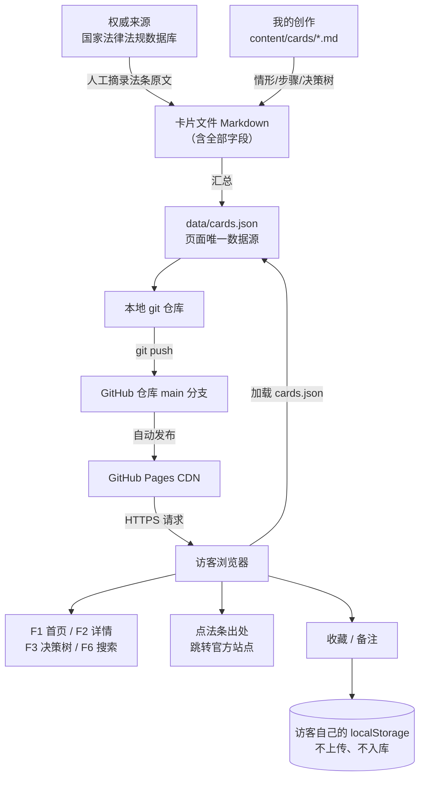

# TECH_DESIGN.md — 法律小科普轻站 V1 技术设计

> 第 1 周 · Day 5 技术设计文档  
> 上游：`PRD.md`（Day 4）｜下游：目录与 UI 搭建（Day 6）、MVP 上线（Day 7）  
> 本文档只做**技术路线 + 数据流图**，不写代码。

---

## 0. 一句话说清：数据从哪来、到哪去

> **数据从「我在本地写的 Markdown 卡片文件」来，汇成一个 JSON，跟着静态页面推上 GitHub，由 GitHub Pages 的 CDN 送到访客浏览器；访客自己产生的收藏和备注只存在他自己的浏览器里，永远不回传。**

展开就是三条线（详见 §4）：

| 线 | 从哪来 | 到哪去 |
|----|--------|--------|
| **内容线** | 国家法律法规数据库（法条原文）+ 我写的 Markdown（情形/步骤/决策树） | `data/cards.json` → 页面读它渲染 |
| **分发线** | 我的电脑（git 仓库） | GitHub 仓库 → GitHub Pages CDN → 访客浏览器 |
| **用户线** | 访客在页面上的点击（收藏 / 备注） | 只写进访客自己的 `localStorage`，**不出浏览器** |

---

## 1. 先分清三件事：前端 / 后端 / 数据库（Day 5 板块 ①）

| 角色 | 住在哪 | 负责什么 | 打个比方 |
|------|--------|---------|---------|
| **前端** | 访客的浏览器 | 显示页面、响应点击、做动画 | 餐厅的**大堂和菜单** |
| **后端** | 服务商的服务器 | 存数据、查数据、判断谁有权限 | 餐厅的**后厨** |
| **数据库** | 服务器上（后端旁边）| 长期保存数据（用户、订单、内容）| 后厨的**仓库** |

**识别口诀**：凡是"在别人电脑上替你保管东西"的需求，才需要后端和数据库。  
我们的 V1 只是"把准备好的内容送到用户眼前"，所以……

### 1.1 V1 的功能归谁管

| 功能 | 前端 | 后端 | 数据库 | 说明 |
|------|:---:|:---:|:---:|------|
| F1 情形清单 | ✅ | ❌ | ❌ | 卡片内容构建时已写进 `cards.json` |
| F2 详情页 | ✅ | ❌ | ❌ | 同样是静态数据，切换页面即可 |
| F3 看情况选我做 | ✅ | ❌ | ❌ | 决策树逻辑写死在 `app.js`，纯前端判断 |
| F4 收藏 / 备注 | ✅ | ❌ | ❌ | 存访客自己的 `localStorage` |
| F5 法条聚合 | ✅ | ❌ | ❌ | 页面加载时从 `cards.json` 现算 |
| F6 搜索 | ✅ | ❌ | ❌ | 前端字符串匹配，不请求服务器 |
| F7 关于页 | ✅ | ❌ | ❌ | 静态页面 |

> **结论：V1 没有后端，没有数据库。** 所有"数据"都在构建时就准备好了，是一堆躺着的文件。
> 这不只是"省事"，更是**合规优势**：不收集任何用户信息，就不需要处理个人信息保护那套麻烦（PRD §8.3 验收要求）。

### 1.2 什么时候才需要后端和数据库

| 需求 | 需要什么 | 预计时间 |
|------|---------|---------|
| 收藏跨设备同步（换手机还在） | 后端 + 数据库 + 用户体系 | Day 23 之后 |
| 不写代码就能发卡片（内容后台） | 后端 + 数据库 / 或现成 CMS | 第 4 周 |
| 看阅读量、热搜词 | 后端 + 统计服务 | 第 4 周 |
| 评论区 | 后端 + 数据库 + 内容审核 | 第 4 周（且要过合规） |

---

## 2. 技术路线（Day 5 板块 ②）

### 2.1 技术路线（一句话版）

> ## 🧭 **Markdown 写内容 + 原生 HTML/CSS/JS 渲染 + GitHub Pages 托管；无后端、无数据库，搜索 / 决策树 / 收藏全部在浏览器里完成。**

这句话对应 Day 5 的掌握目标：**数据从哪来（Markdown 内容源）→ 到哪去（静态页面 → CDN → 浏览器）**。

### 2.2 拆成 4 个决定

| # | 决定 | 选择 | 为什么这么选 |
|---|------|------|-------------|
| D1 | **内容用什么格式存** | Markdown（每张卡一个 `.md`，头部带字段） | 人和 AI 都好写；git 里能看改动；字段可扩展；出问题能直接读 |
| D2 | **页面怎么渲染** | 原生 HTML/CSS/JS + 一个 `cards.json`，用 JS 渲染列表 | 零构建步骤、零依赖；12 张卡的量级完全够用；Day 7 前能完全掌控 |
| D3 | **部署到哪** | GitHub Pages | 已经在用 GitHub；免费；自动 HTTPS；`git push` 即发布；不用多注册账号 |
| D4 | **交互功能怎么做** | 纯前端 JS；收藏/备注存 `localStorage` | 无后端也能有"功能感"；不采集用户数据 = 合规最省事 |

### 2.3 为什么暂时不选框架（候选方案对比）

> 这是"卡住降级"要求的部分：不做多方案深入比较，但**要写清为什么暂时选它**。

| 方案 | 优点 | 劣势 | V1 结论 |
|------|------|------|---------|
| **原生 HTML/CSS/JS + JSON** | 零构建、打开即跑、出错好查、学习成本最低 | 卡片上百张后要自己管渲染逻辑 | ✅ **选它** |
| Astro（内容站专用）| 天生支持 Markdown、构建产物小 | 要装 Node 构建链、多一层概念 | 🔶 备选（Day 9 后可平滑迁移）|
| Vite + React | 生态大、组件化、社区资料多 | 学习成本高；12 张卡属于杀鸡用牛刀 | ❌ 暂不选 |
| WordPress 等 CMS | 所见即所得、非技术人也能发 | 需要服务器 + 数据库 + 维护成本 + 有被攻击面 | ❌ 不是 V1 的形态 |
| 直接手写 12 个 HTML 页面 | 最直观、无需 JS 渲染 | 改一次样式要改 12 个文件 | ❌ 立刻会痛 |

**关键设计：内容和页面分开。**  
卡片内容在 `content/cards/*.md`，页面只负责"读数据 + 显示"。所以将来换成 Astro 或 React，**内容文件一个字都不用改**（见 §6 影响表）。

### 2.4 部署链路

```
我写卡片  →  git commit  →  git push GitHub  →  GitHub Pages 自动发布  →  访客打开网址
  本地          本地            远程仓库              CDN 分发               浏览器
```

- 访问地址（预计）：`https://terry-rqj.github.io/week01-vibe-coding/`
- HTTPS：GitHub 自动提供，无需购买证书
- 发布延迟：约 1 分钟
- 提醒：仓库是 Public，**页面内容也是公开的**（符合 PRD §8.4 可访问性验收）

---

## 3. 目录结构（Day 6 按这个建）

```
Vibe Coding/                     ← 项目根（桌面文件夹）
├── index.html                   # P1 首页：情形清单 + 搜索框（F1 / F6）
├── article.html                 # P2 详情页：读 ?id=xxx 渲染卡片（F2 / F3）
├── laws.html                    # P3 法条聚合（F5）
├── bookmarks.html               # P4 我的收藏（F4）
├── about.html                   # P5 关于 + 免责声明（F7）
├── 404.html                     # 兜底页
├── assets/
│   ├── style.css                # 全站样式（响应式断点在这）
│   └── app.js                   # 渲染 / 搜索 / 决策树 / 收藏 的全部逻辑
├── content/
│   └── cards/
│       ├── qiye-cuidui.md       # 「被公司劝退」卡片
│       ├── tuizu-yajin.md       # 「房东不退押金」卡片
│       └── ...                  # 每张卡片一个文件（唯一的内容源）
├── data/
│   └── cards.json               # 由 content/ 汇总而来，页面读这个
└── （已有文档）AGENTS.md / research.md / PRD.md / TECH_DESIGN.md / .gitignore / .env
```

> `.env` 只在本机，已被忽略规则挡住，不会上传（Day 2 已验证）。

---

## 4. 数据流图（Day 5 板块 ③）

### 4.1 主图（文字版，任何编辑器里都能看）

```
═══════════════ 线 1：内容从哪来（发生在我电脑上，用户看不到）═══════════════

   【权威来源】                        【我的创作】
   国家法律法规数据库                    每张卡片一个 .md 文件
   flk.npc.gov.cn                     content/cards/qiye-cuidui.md
        │                                    │
        │ 人工摘录法条原文                      │ 写：情形 / 解决步骤 / 决策树
        ▼                                    ▼
   ┌────────────────────────────────────────────────────┐
   │  卡片文件（Markdown，头部带字段：id / 标题 / 分类 /   │
   │  法条 / 步骤 / 决策树 / 出处链接 / 复核人 …）         │
   └────────────────────────────────────────────────────┘
                            │
                            │ 汇总（脚本或手工整理）
                            ▼
                 ┌──────────────────────┐
                 │  data/cards.json     │  ← 页面唯一的数据源
                 │ （12 张卡的结构化数据）│
                 └──────────────────────┘

═══════════════ 线 2：内容怎么送到用户眼前 ═══════════════

   我的电脑               GitHub 仓库              GitHub Pages            访客浏览器
   ┌────────┐  git push  ┌──────────┐  自动发布   ┌──────────┐   请求    ┌──────────┐
   │ 本地仓库│ ─────────► │ main 分支 │ ─────────► │ CDN 服务器│ ────────► │ 打开网页 │
   └────────┘            └──────────┘             └──────────┘   HTTPS   └────┬─────┘
                                                                             │
                                                        页面加载 cards.json ──┘
                                                                             │
                             ┌───────────────────────────────────────────────┤
                             ▼                        ▼                      ▼
                    F1 首页渲染卡片列表      F6 搜索在前端过滤        点法条 → 跳官方站点
                                                                     （离开我们的站，不经过我们）

═══════════════ 线 3：用户在站上产生的数据去哪（关键：不回传）═══════════════

   访客点「收藏」或写「备注」
              │
              ▼
   ┌─────────────────────────────────────────────┐
   │  访客自己浏览器的 localStorage               │
   │  bookmarks = ["qiye-cuidui", ...]           │
   │  notes:qiye-cuidui = "我妈遇到的也是这个…"    │
   └─────────────────────────────────────────────┘
              │
              │  ❌ 不上传服务器   ❌ 不进数据库   ❌ 我们看不到
              ▼
     换设备 / 清浏览器数据 = 收藏就没了
     （所以 PRD 要求页面必须明确提示这一点）
```

### 4.2 同一张图（Mermaid 版，GitHub 网页上会渲染成图形）



### 4.3 三句话总结（背下来就够）

1. **内容**：官方数据库抄法条 + 我写成 Markdown → 汇总成 `cards.json`
2. **分发**：`git push` → GitHub → Pages 的 CDN → 用户浏览器（全静态，没有后厨）
3. **用户数据**：收藏/备注只躺在他自己浏览器里，我们既看不到也没法用

---

## 5. 数据字段的落地（对齐 PRD §6）

| PRD 里的字段 | 存在哪 | 谁产生 | 举例 |
|-------------|--------|--------|------|
| `id` / `slug` | md 文件头部 | 我 | `qiye-cuidui` |
| `title` / `summary` | md 文件头部 | 我 | 「被公司劝退，先别签那张纸」 |
| `category` / `tags` | md 文件头部 | 我 | `劳动` / `["劝退","赔偿"]` |
| `scenario`（情形） | md 正文 | AI 起草 + 我改 | 「假设你今天下午被叫进会议室……」 |
| `laws[].content`（法条原文） | md 正文 + 出处链接 | **人工从官方库摘录** | 《劳动合同法》第 47 条 |
| `solution_steps`（怎么解决） | md 正文 | 我 | 「① 别当场签字 ② 手机录音 ③ 打 12348」 |
| `decision_tree`（决策树） | md 正文（YAML 块）| 我 | 3 层问题 → 3 个终点 |
| `related_articles` | md 文件头部 | 我 | `["tuizu-yajin", "gongshang-jianding"]` |
| `reviewed_by` / `updated_at` | md 文件头部 | 我 | 复核人 + 日期（可追溯）|
| 收藏 / 备注 | **访客浏览器** `localStorage` | **访客自己** | 我们这边**没有**这些数据 |

---

## 6. 余力加练 ①：方案变化时，哪些文件会受影响

| 如果发生这个变化 | 要改的文件 | **不用动**的文件 |
|-----------------|-----------|----------------|
| 换配色 / 改字体 | `assets/style.css` | 内容、数据、页面结构 |
| 首页从"分类列表"改成"卡片瀑布流" | `index.html` + `assets/app.js` 里的渲染函数 | `content/` 全部内容、`cards.json` |
| 增删一张卡片 | `content/cards/` 加/删一个 md → 重新汇总 | 所有页面与样式 |
| 给卡片加一个新字段（比如"常见误区"） | 卡片 md + `app.js` 渲染 + `style.css` | 已发布的其他卡片（字段可缺省）|
| 从原生 JS 迁到 Astro / React | 页面模板 + 渲染逻辑 | **`content/` 与 `cards.json` 一字不改** ← 这就是内容/页面分离的价值 |
| 加用户登录（Day 23） | 新增后端服务 + 数据库；`app.js` 里收藏逻辑改为调接口 | 内容、页面基本不动 |
| 换托管平台（Pages → Vercel） | 域名与部署配置 | 本地仓库内容**完全不动** |

> **一句话**：内容和页面分开以后，"改样子"和"改内容"互不牵连，这是 V1 最省心的结构性决定。

---

## 7. 余力加练 ②：技术栈扫盲 —— 做网页/App 会用到哪些技术

### 7.1 前端（跑在用户浏览器里）

| 技术 | 作用 | 优势 | 劣势 |
|------|------|------|------|
| **HTML** | 页面的"骨架"：标题、段落、按钮 | 简单、是网页的地基 | 只能描述结构，不会动 |
| **CSS** | 页面的"衣服"：颜色、字号、排版、响应式 | 一份样式管全站；能适配手机 | 布局细节坑多（居中、对齐）|
| **JavaScript** | 页面的"肌肉"：点击响应、渲染列表、算搜索 | 浏览器原生支持，能做任何交互 | 代码多了要自己管结构 |
| **框架**（React/Vue） | 把界面拆成组件，数据变界面自动变 | 大型项目好维护、生态大 | 学习成本高、要构建工具 |
| **静态站点生成器**（Astro/Next） | 把 Markdown 批量变成网页 | 适合内容站、性能好 | 多一层工具链要学 |

### 7.2 后端（跑在服务器上）

| 技术 | 作用 | 说明 |
|------|------|------|
| Node.js / Python / Java / Go | 写服务器程序的"语言" | 处理请求、算逻辑、调数据库 |
| 接口（API / REST） | 前端和后端说话的"普通话" | 前端问「给我第 3 张卡」，后端回 JSON |
| 鉴权（登录态） | 判断"你是谁、能不能看" | 用户体系的地基 |

### 7.3 数据库（长期存数据）

| 类型 | 代表 | 适合 | 我们的情况 |
|------|------|------|-----------|
| 关系型 | MySQL / PostgreSQL | 用户、订单这类强关系数据 | Day 23 大概率用它 |
| 文档型 | MongoDB | 结构灵活的内容 | 备选 |
| 键值型 | Redis | 缓存、排行榜 | 用不到 |

### 7.4 部署与其它

| 技术 | 作用 | 我们的选择 |
|------|------|-----------|
| 静态托管 | 把静态页面免费发到全网 | ✅ GitHub Pages |
| 云服务器 | 跑后端程序 | ❌ V1 用不到 |
| CDN | 把内容缓存到离用户最近的节点 | ✅ 由 Pages 附带 |
| Git / GitHub | 版本管理 + 协作 + 部署通道 | ✅ 已在用 |

> **给初学者的结论**：一个网站不是"一种技术"，而是**前端（HTML/CSS/JS）+ 可选的后端 + 可选的数据库 + 部署**这几层拼起来。我们 V1 只用了第一层和部署层——这就是"轻站"的"轻"。

---

## 8. 不做与已知风险

| 项 | 说明 |
|----|------|
| ❌ 不写代码（本文档） | Day 5 只做设计，Day 6–7 才动手 |
| ❌ 不做后端 / 数据库 | 见 §1.2 的时间表 |
| ❌ 不引入构建工具 | 保住"零依赖"这个最大优势 |
| ⚠️ 风险：卡片数量增长 | 超过约 50 张后，前端渲染与检索会开始吃力 → 那时再迁 Astro（迁移成本已降到最低）|
| ⚠️ 风险：`cards.json` 手工维护易错 | Day 6 会加一个极简汇总步骤（脚本或固定模板），保证格式一致 |
| ⚠️ 风险：内容是静态的 | 改内容必须重新 push（约 1 分钟生效），这是"无后端"的代价，V1 可接受 |

---

## 9. Day 7 上线验收对照（对齐 PRD §8.4）

- [ ] 网站能通过公开 URL 访问，HTTPS 已启用
- [ ] 首屏 4G 模拟下 < 2 秒（静态站天然优势）
- [ ] 375px / 768px / 1024px 三档都正常，无横向滚动条
- [ ] 所有交互（搜索 / 决策树 / 收藏）**不产生任何网络请求**（DevTools Network 面板可验证）
- [ ] 仓库里没有 `.env`、密钥、Token 等敏感文件

---

*Day 5 输出 · 技术路线：Markdown 内容 + 原生 HTML/CSS/JS + GitHub Pages · 无后端无数据库*  
*Day 6 据此搭目录与 UI；Day 7 据此上线 MVP*  
*2026-09-20*
